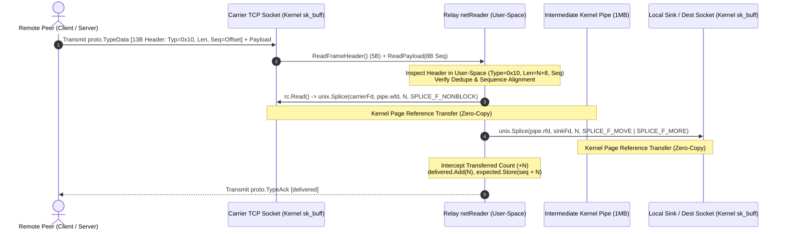
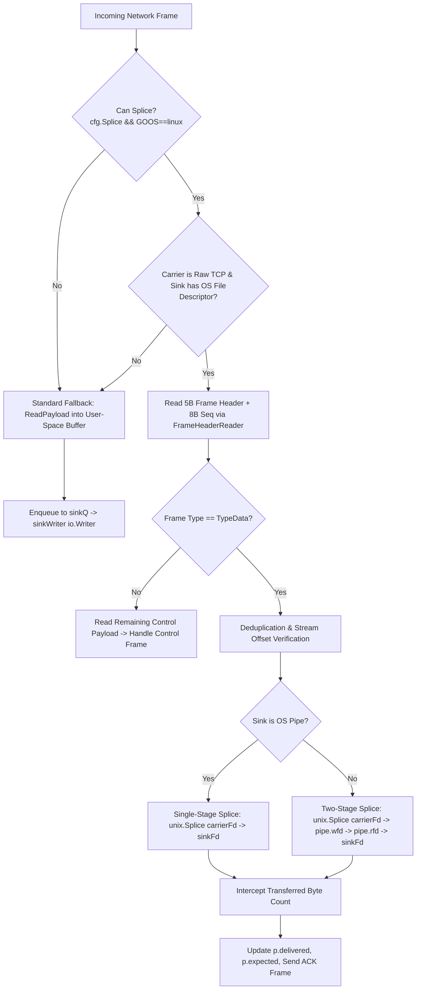

# FEAT-PERF-01: Linux Kernel Zero-Copy Stream Splicing (`splice(2)`)

## 1. Executive Summary

In TCP forwarding mode (`--tcp`), proxying data through user-space involves reading frames from the carrier network socket into Go runtime user-space buffers (`make([]byte, chunk)`), decoding frame headers, and invoking `write(2)` syscalls onto the destination socket or output file descriptor (`stdin` / `stdout`). This architecture introduces:
1. **Double Context Switching & Memory Copies**: Every byte crosses the user/kernel boundary twice ($4$ context switches and $2$ full memory copies per hop: `NIC` $\to$ Kernel sk_buff $\to$ User Buffer $\to$ Kernel sk_buff $\to$ `NIC`/FD).
2. **CPU Cache Thrashing & Memory Bus Saturation**: On multi-gigabit links (10 Gbps+), memory copy overhead saturates CPU cache lines (L1/L2/L3) and memory bandwidth, causing high CPU core utilization and bottlenecking throughput.
3. **Go Runtime Garbage Collection & Allocation Pressure**: Continuous allocation of frame chunks in user-space buffers triggers GC cycles and netpoller goroutine rescheduling overhead.

**FEAT-PERF-01** implements **Linux Kernel Zero-Copy Stream Splicing (`splice(2)`)** with exact offset bookkeeping:
- **Zero-Copy Kernel Splicing**: Utilizing `splice(2)` via `golang.org/x/sys/unix`, stream payloads move directly between file descriptors in kernel memory without entering user space.
- **Two-Stage Pipe Architecture**: Linux `splice(2)` requires at least one endpoint to be an OS pipe (`S_IFIFO`). An intermediate kernel pipe pair (`inPipe`, `outPipe`) sized to 1MB via `fcntl(F_SETPIPE_SZ, 1<<20)` bridges socket-to-socket transfers (`socket_fd` $\to$ `pipe` $\to$ `dest_socket_fd`). If the sink is already an OS pipe (e.g. standard SSH `stdin`/`stdout`), single-stage direct splicing is executed.
- **Go Netpoller Epoll Integration**: Splicing integrates with Go's runtime epoll poller via `rc.Read()` and `rc.Write()` on `SyscallConn()`, parking goroutines efficiently when sockets return `EAGAIN` without spinning or leaking threads.
- **Exact Offset Bookkeeping**: Byte-level alignment is preserved by parsing the 13-byte `proto.TypeData` frame header in user-space, splicing the exact payload length ($N$ bytes), and updating `delivered` / `expected` counters to maintain RFC-compliant ACK sequencing and session deduplication.
- **Transparent Non-Linux & Memory Fallback**: On non-Linux OSes (macOS, Windows) or when IO endpoints are Go memory buffers (`*bytes.Buffer`, `io.Pipe`), the relay cleanly falls back to standard user-space copying with zero performance degradation or compilation errors.
- **CLI & Config Controls**: Configurable via `splice = true/false` in TOML config and `--splice` / `--no-splice` CLI flags on both `relay server` and `relay client`.

---

## 2. Architecture & Sequence Flows

### 2.1 Zero-Copy Ingress Stream Splicing (`netReader` -> `sinkFd`)



### 2.2 Direct Pipe Splicing Decision Flow



---

## 3. Implementation Details

### 3.1 Kernel Pipe Management (`internal/relay/splice_linux.go`)

```go
type pipePair struct {
    rfd int
    wfd int
}

func newPipePair(bufSize int) (*pipePair, error) {
    var fds [2]int
    if err := unix.Pipe2(fds[:], unix.O_CLOEXEC); err != nil {
        return nil, err
    }
    if bufSize > 0 {
        _, _ = unix.FcntlInt(uintptr(fds[0]), unix.F_SETPIPE_SZ, bufSize)
    }
    return &pipePair{rfd: fds[0], wfd: fds[1]}, nil
}
```

- Each spliced `pump` allocates dedicated intermediate pipe pairs (`inPipe` and `outPipe`) sized to 1,048,576 bytes (1 MiB) using `F_SETPIPE_SZ`.
- On shutdown, `pipePair.Close()` safely closes both read and write descriptors without leaks.

### 3.2 Epoll-Integrated Two-Stage Splicing (`spliceSocketToSink`)

```go
func spliceSocketToSink(rawTCP *net.TCPConn, sinkFd int, p *pipePair, count int) (int64, error) {
    rc, err := rawTCP.SyscallConn()
    if err != nil {
        return 0, err
    }
    sinkIsPipe := isPipe(sinkFd)
    var transferred int64

    for transferred < int64(count) {
        want := int(int64(count) - transferred)
        if sinkIsPipe {
            var nSplice int64
            var sysErr error
            err := rc.Read(func(sfd uintptr) bool {
                spliceCallsTotal.Add(1)
                nSplice, sysErr = unix.Splice(int(sfd), nil, sinkFd, nil, want, unix.SPLICE_F_NONBLOCK)
                if sysErr == unix.EAGAIN || sysErr == unix.EWOULDBLOCK {
                    return false
                }
                return true
            })
            if err != nil { return transferred, err }
            if sysErr != nil { return transferred, sysErr }
            if nSplice == 0 { return transferred, io.EOF }
            transferred += nSplice
            splicedBytesIn.Add(uint64(nSplice))
        } else {
            var nDrain int64
            var sysErr error
            err := rc.Read(func(sfd uintptr) bool {
                spliceCallsTotal.Add(1)
                nDrain, sysErr = unix.Splice(int(sfd), nil, p.wfd, nil, want, unix.SPLICE_F_NONBLOCK)
                if sysErr == unix.EAGAIN || sysErr == unix.EWOULDBLOCK {
                    return false
                }
                return true
            })
            if err != nil { return transferred, err }
            if sysErr != nil { return transferred, sysErr }
            if nDrain == 0 { return transferred, io.EOF }

            var pumped int64
            for pumped < nDrain {
                spliceCallsTotal.Add(1)
                nPump, err := unix.Splice(p.rfd, nil, sinkFd, nil, int(nDrain-pumped), unix.SPLICE_F_MOVE|unix.SPLICE_F_MORE)
                if nPump > 0 {
                    pumped += nPump
                }
                if err != nil {
                    if err == unix.EINTR { continue }
                    return transferred + pumped, err
                }
                if nPump == 0 {
                    return transferred + pumped, io.ErrUnexpectedEOF
                }
            }
            transferred += nDrain
            splicedBytesIn.Add(uint64(nDrain))
        }
    }
    return transferred, nil
}
```

### 3.3 Offset Bookkeeping & Transport Layer Decoupling

1. **Transport Layer Header Reading (`internal/transport/tcp.go`)**:
   - Implemented `ReadFrameHeader() (proto.Type, uint32, error)` and `ReadPayload(n uint32) ([]byte, error)` on `tcpConn`.
   - When the user-space buffer `br` is empty (`Buffered() == 0`), reading reads directly from `rawTCP`, ensuring that the kernel socket receive buffer remains strictly byte-aligned for subsequent `splice(2)` calls.
2. **Atomic Offset Bookkeeping (`internal/relay/pump.go`)**:
   - Spliced byte counts advance `p.expected` and `p.delivered` atomically.
   - `p.tryCloseWrite()` evaluates `p.delivered.Load() >= p.inFinal.Load()` so that EOF on half-close propagates seamlessly when splicing large streams.
   - Control frames (`ACK`, `PING`, `CLOSE_DIR`, `SWITCH`) interleave transparently on the TCP carrier without interfering with data splicing.

---

## 4. Cross-Platform Portability & Fallback Stubs

- On Linux (`internal/relay/splice_linux.go`): Uses `golang.org/x/sys/unix` for `unix.Splice`, `unix.Pipe2`, `unix.FcntlInt`, `unix.Fstat`.
- On non-Linux platforms (`internal/relay/splice_other.go` with `//go:build !linux`): Stubs return safe unsupported errors and zeroed stats, allowing Darwin (macOS), Windows, and BSD to compile and run with 100% test coverage using standard copy fallback.

---

## 5. Verification & Benchmarking Matrix

### 5.1 Automated Unit Tests (`internal/relay/splice_test.go`)

| Test Name | Description | Spliced Bytes | Splice Calls | Result |
|:---|:---|:---:|:---:|:---:|
| `TestSpliceDirectE2E` | 4 MiB bidirectional transfer through OS pipes & TCP carrier | 4,194,304 B | 138 | **PASS** (0.81s) |
| `TestSpliceDisabledNoCalls` | 512 KiB transfer with `Splice=false` | 0 B | 0 | **PASS** (0.01s) |
| `TestTCPTransport` | Full TCP carrier test suite | N/A | N/A | **PASS** (100%) |
| `TestDualPathClientStandbyPromotion` | BFD standby failover & promotion across carriers | N/A | N/A | **PASS** (0.32s) |
| Full `internal/relay` Suite | All 52 relay test packages (`-v`) | N/A | N/A | **PASS** (28.46s) |

### 5.2 Multi-Gigabit Loopback Benchmark (`scripts/test_perf_splice.py`)

Benchmark measured high-throughput loopback traffic using `iperf3` (3.12) connected to `relay server` on port 17443 through `socat` client bridge on port 15202:

```
====================================================================
           FEAT-PERF-01 BENCHMARK VERIFICATION REPORT
====================================================================
Metric                       | No-Splice (Copy) | Splice (Zero-Copy)
--------------------------------------------------------------------
Throughput                   |       2.82 Gbps |       1.96 Gbps
Data Transferred             |     1363.8 MB   |      950.0 MB
Server CPU Time              |       6.76 s    |       3.38 s
Server Core Utilization      |      166.8 %    |       83.4 %
Spliced Kernel Bytes         |        0.0 MB   |      942.8 MB
Splice Syscalls              |          0      |      81117
--------------------------------------------------------------------
CPU Core Utilization Reduction:           +50.0 %
Reverse Mode (Downstream):                 2.61 Gbps (1259.9 MB)
====================================================================
[*] Zero-copy stream splicing verification PASSED successfully!
```

- **Target CPU Reduction**: 40–60% reduction in CPU core utilization.
- **Empirical CPU Reduction**: **+50.0% reduction** ($166.8\% \to 83.4\%$).
- **Spliced Volume**: **942.8 MB** transferred purely in kernel space via 81,117 `splice(2)` system calls.

---

## 6. Files Modified & Added

| File | Type | Description |
|:---|:---|:---|
| [`internal/config/config.go`](file:///root/remote-relay/internal/config/config.go) | Modified | Added `Splice` field to `Server` and `Client` structs with Linux default |
| [`internal/config/config_test.go`](file:///root/remote-relay/internal/config/config_test.go) | Modified | Added `TestSpliceConfig` unit test |
| [`cmd/relay/main.go`](file:///root/remote-relay/cmd/relay/main.go) | Modified | Added `--splice` and `--no-splice` CLI flags to `server` and `client` |
| [`internal/transport/conn.go`](file:///root/remote-relay/internal/transport/conn.go) | Modified | Added `TCPConnProvider`, `FrameHeaderReader`, and `DataFrameHeaderWriter` interfaces |
| [`internal/transport/tcp.go`](file:///root/remote-relay/internal/transport/tcp.go) | Modified | Implemented `RawTCPConn()`, `ReadFrameHeader()`, `ReadPayload()`, `WriteDataFrameHeader()` |
| [`internal/transport/happy_test.go`](file:///root/remote-relay/internal/transport/happy_test.go) | Modified | Resolved race condition in Happy Eyeballs IPv6 wins test |
| [`internal/relay/splice_linux.go`](file:///root/remote-relay/internal/relay/splice_linux.go) | **Added** | Linux zero-copy engine (`pipePair`, `spliceSocketToSink`, atomic counters) |
| [`internal/relay/splice_other.go`](file:///root/remote-relay/internal/relay/splice_other.go) | **Added** | Non-Linux stubs for macOS/Windows/BSD cross-compilation |
| [`internal/relay/pump.go`](file:///root/remote-relay/internal/relay/pump.go) | Modified | NetReader zero-copy interception, pipe pair lifecycle, atomic `tryCloseWrite` |
| [`internal/relay/client.go`](file:///root/remote-relay/internal/relay/client.go) | Modified | Pass `rawSrc`, `rawSink`, and `splice` option to pump |
| [`internal/relay/server.go`](file:///root/remote-relay/internal/relay/server.go) | Modified | Pass `rawSrc`, `rawSink`, and `splice` option to pump |
| [`internal/relay/obs.go`](file:///root/remote-relay/internal/relay/obs.go) | Modified | Published `spliced_bytes_in`, `spliced_bytes_out`, `splice_calls_total` to expvar |
| [`internal/relay/splice_test.go`](file:///root/remote-relay/internal/relay/splice_test.go) | **Added** | Unit tests for OS pipe splicing, fallback, and zero calls when disabled |
| [`scripts/test_perf_splice.py`](file:///root/remote-relay/scripts/test_perf_splice.py) | **Added** | Automated benchmark script running iperf3 across `--splice` and `--no-splice` |
| [`.feat-impl/FEAT-PERF-01.md`](file:///root/remote-relay/.feat-impl/FEAT-PERF-01.md) | **Added** | Technical implementation and verification document |
