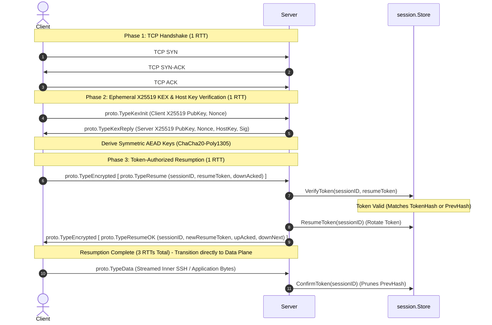
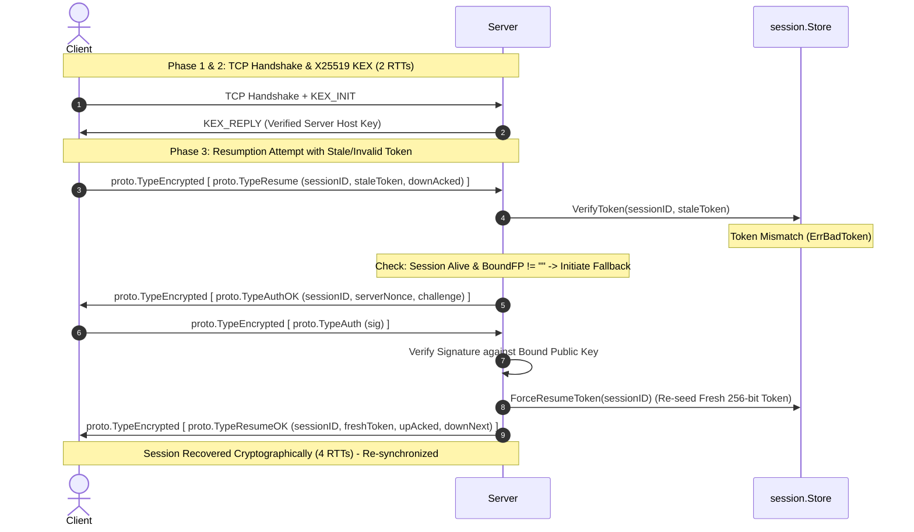

# FEAT-PERF-03: Fast 3-RTT Token-Authorized Resumption in Encrypted AEAD Plane

## 1. Executive Summary

In Milestone 5, reconnection required a full public-key challenge-response exchange (`RESUME` $\to$ `AUTH_OK` $\to$ `AUTH` $\to$ `RESUME_OK`) because the control plane was transmitted in cleartext JSON, requiring strong public-key authentication on every connection to prevent session hijacking.

With the delivery of [**FEAT-SEC-01**](FEAT-SEC-01.md), every reconnection begins with an ephemeral X25519 Diffie-Hellman exchange and Ed25519 host key verification, establishing a forward-secret ChaCha20-Poly1305 AEAD tunnel before any control frame is transmitted. Because the transport channel is cryptographically authenticated and protected against eavesdropping and MITM attacks, retaining mandatory public-key signatures inside the encrypted tunnel imposed severe penalties:
1. **Network Turn Penalty (4 RTTs / 8 Frame Turns)**: Every resume required 4 sequential round-trips (TCP SYN $\to$ KEX $\to$ RESUME/AUTH_OK $\to$ AUTH/RESUME_OK), adding ~82ms (+34%) latency on an 80ms WAN link.
2. **TCP RTO Amplification on Flaky Networks**: Dropped frames during multi-turn handshakes triggered TCP Retransmission Timeouts (RTOs) with multi-second stalls.
3. **Hardware Token & Standby Stalls**: YubiKey / FIDO2 security keys (`sk-ssh-ed25519@openssh.com`) and keys with confirmation prompts (`ssh-add -c`) required physical touch or prompt confirmation on every reconnect, stalling automatic background reconnections and `--allow-ha` standby probes.

**FEAT-PERF-03** resolves these issues by implementing **Fast 3-RTT Token-Authorized Resumption** with **Transparent Cryptographic Fallback**:
- **Initial Connection (`HELLO`)**: Performs full multi-factor authentication (KEX + host key check + SSH public key signature). The server binds the client identity and issues a 32-byte cryptographically secure random `resumeToken`.
- **Fast-Path Resumption (`RESUME`)**: The client presents its rotating 256-bit `resumeToken` inside the AEAD tunnel. The server verifies the token against `store.VerifyToken`, immediately accepts the connection, and responds directly with `TypeEncrypted[RESUME_OK]` containing the next-generation rotated token—completing reconnection in **3 RTTs** (saving 1 full RTT and 2 network frame turns).
- **Transparent Fallback Recovery**: If the presented token is stale, invalid, or missing, the server transparently issues a `TypeEncrypted[AUTH_OK]` challenge to allow cryptographic recovery via the session's bound public key rather than dropping the session.
- **Hardware Token Friendly**: Hardware keys only require physical interaction once during initial session establishment; background standby loops and transient drop recovery proceed silently.

---

## 2. Protocol Architecture & Sequence Flows

### 2.1 Fast-Path 3-RTT Resumption (Token-Authorized)

### 2.2 Transparent Cryptographic Fallback (Token Mismatch / Stale Generation)

---

## 3. Wire Framing & Protocol Semantics

### 3.1 Fast-Path Processing Rules (`internal/relay/server.go`)
1. When receiving `proto.TypeResume`:
   - Verify session exists in `s.lives[msg.SessionID]`. If missing, check `s.store.IsExpired(msg.SessionID)` and reply with `proto.CodeExpired` or `proto.CodeUnknownSession`.
   - Call `s.store.VerifyToken(msg.SessionID, msg.ResumeToken)`.
   - **Fast Path (`err == nil`)**:
     - Skip `s.resumeAuth` challenge-response.
     - Attach the connection immediately via `l.AttachStandby` (if standby) or `l.Offer`.
     - In `l.writeResumeOK`, rotate the token via `l.store.ResumeToken(l.id)` and return `proto.TypeResumeOK`.
   - **Fallback Path (`err != nil`)**:
     - If `s.auth.RequiresChallenge()` is true and the session has a bound key (`sess.Fingerprint != ""`):
       - Execute `s.resumeAuth(conn, msg, f.Payload)`.
       - If signature verification fails or times out: server enforces constant-time delay `s.authFail(conn, started)` and sends `proto.CodeAuth`.
       - If signature verification succeeds: force re-seed a fresh token via `l.store.ForceResumeToken(l.id)` and return `proto.TypeResumeOK`.
     - If `s.auth.RequiresChallenge()` is false: fail immediately with `proto.CodeBadToken`.

### 3.2 Client Processing Rules (`internal/relay/upgrade.go`)
1. In `writeResumeRole`:
   - If local keys are available without prompting, populate `msg.Auth` opportunistically. If key loading fails but a valid `token` is held, do not abort; transmit `RESUME` without `msg.Auth`.
   - Send `proto.TypeResume`.
   - Read next frame:
     - If `proto.TypeResumeOK`: Fast 3-RTT completion. Unmarshal and resume data streaming immediately.
     - If `proto.TypeAuthOK`: Server requested fallback. Execute `completeClientAuth`, sign challenge digest, and await `proto.TypeResumeOK`.
     - If `proto.TypeResumeFail` or `proto.TypeErr`: Terminal failure, abort or enter backoff.

### 3.3 Two-Generation Token Rotation Lifecycle (`internal/session/store.go`)
- `ResumeToken(id)`: Moves current `TokenHash` to `PrevHash`, sets `hasPrev = true`, generates new 256-bit random token `plain` and `hash`, sets `currentPlain = plain`. Reuses `currentPlain` if called repeatedly without confirmation.
- `ConfirmToken(id)`: Called upon receipt of the first data frame on the resumed connection. Clears `currentPlain`, deletes `PrevHash`, finalizing the rotation.
- `ForceResumeToken(id)`: Used on fallback cryptographic recovery. Unconditionally wipes `currentPlain` and rotates to a guaranteed fresh token generation.

---

## 4. Verification & Testing Matrix

| Test Case | Description | Verification Method |
| :--- | :--- | :--- |
| `TestFastResumeToken3RTT` | Token-authorized resume succeeds directly in 3 RTTs without `AUTH_OK`. | Go Unit Test (`auth_test.go`) |
| `TestResumeTokenFallbackRecovery` | Invalid token transparently triggers `AUTH_OK` and recovers session. | Go Unit Test (`auth_test.go`) |
| `TestResumeTokenFallbackFailureOnWrongKey` | Invalid token + wrong key fails with `ERR_AUTH` and enforce `FailDelay`. | Go Unit Test (`auth_test.go`) |
| `TestResumeTokenAloneSuccess` | Resuming with valid token and zero client private key material succeeds. | Go Unit Test (`auth_test.go`) |
| `TestResumeTokenFallbackNoneAuthFails` | Bad token on unauthenticated (`none`) session fails with `ERR_BAD_TOKEN`. | Go Unit Test (`auth_test.go`) |
| `TestResumeTokenRotationTwoGenerations` | Dropped `RESUME_OK` allows retry using previous generation token. | Go Unit Test (`resume_test.go`) |
| `test_perf_resume.py` | Dual-netns simulation asserting 3-RTT latency (~240ms under 80ms RTT) and zero signature delegations. | Python Netns Simulation |
