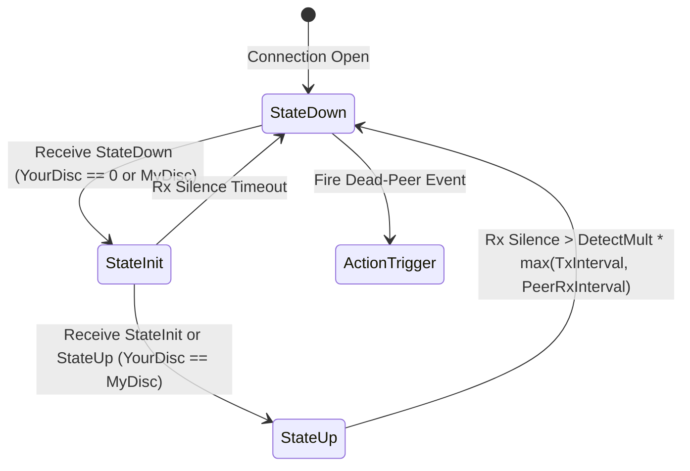

# FEAT-ROB-01: Sub-Second Dead-Peer Detection & Dual-Path BFD Architecture

## 1. Executive Summary

`remote-relay` currently detects silent link drops (blackholes, mobile handoffs, firewall silence) via `idle_timeout` (default `30s`) and OS TCP keepalives. During sudden outages, the user's terminal freezes for 30 to 60 seconds before reconnecting. Furthermore, in High Availability mode (`--allow-ha`), upgrading to UDP terminates the TCP socket, requiring a cold reconnect from scratch if UDP subsequently fails.

**FEAT-ROB-01** introduces:
1. **Asynchronous BFD State Machine (RFC 5880)** over `proto.TypePing` (0x15) on all transports (QUIC, KCP, and TCP), dropping `PONG` echoes.
2. **Sub-Second Dead-Peer Detection**: Default `750ms` transmission cadence with `3` missed deadlines ($2.25\text{s}$ failure detection ceiling).
3. **Hot-Standby Dual-Path Architecture (`--allow-ha`)**: Concurrently maintains both TCP and UDP connections with active BFD heartbeats on both channels.
4. **Zero-Dial Seamless Failover**: Immediate promotion of the standby channel upon active link failure, paired with an autonomous background reconnect loop for the failed channel.

---

## 2. Technical Architecture & Protocols

### 2.1 BFD Packet Wire Format (`proto.TypePing`)

`proto.TypePing` (0x15) payload is repurposed as a fixed 20-byte binary BFD control frame:

```text
 0                   1                   2                   3
 0 1 2 3 4 5 6 7 8 9 0 1 2 3 4 5 6 7 8 9 0 1 2 3 4 5 6 7 8 9 0 1
+-+-+-+-+-+-+-+-+-+-+-+-+-+-+-+-+-+-+-+-+-+-+-+-+-+-+-+-+-+-+-+-+
|   State (1B)  | DetectMult(1B)|           Flags (2B)          |
+-+-+-+-+-+-+-+-+-+-+-+-+-+-+-+-+-+-+-+-+-+-+-+-+-+-+-+-+-+-+-+-+
|                      My Discriminator (4B)                    |
+-+-+-+-+-+-+-+-+-+-+-+-+-+-+-+-+-+-+-+-+-+-+-+-+-+-+-+-+-+-+-+-+
|                     Your Discriminator (4B)                   |
+-+-+-+-+-+-+-+-+-+-+-+-+-+-+-+-+-+-+-+-+-+-+-+-+-+-+-+-+-+-+-+-+
|                   Desired Min TX Interval (4B, ms)            |
+-+-+-+-+-+-+-+-+-+-+-+-+-+-+-+-+-+-+-+-+-+-+-+-+-+-+-+-+-+-+-+-+
|                  Required Min RX Interval (4B, ms)            |
+-+-+-+-+-+-+-+-+-+-+-+-+-+-+-+-+-+-+-+-+-+-+-+-+-+-+-+-+-+-+-+-+
```

#### Field Definitions
- **`State` (uint8)**:
  - `0x01` = `StateDown`
  - `0x02` = `StateInit`
  - `0x03` = `StateUp`
  *(AdminDown eliminated)*
- **`DetectMult` (uint8)**: Number of consecutive missed packets declaring dead-peer (default `3`).
- **`Flags` (uint16)**: Reserved for diagnostic bits (default `0`).
- **`My Discriminator` (uint32)**: Cryptographically random non-zero identifier generated per connection instance.
- **`Your Discriminator` (uint32)**: Discriminator received from the remote peer (`0` during initial `Down` handshake).
- **`Desired Min TX Interval` (uint32, ms)**: Transmit cadence preferred by local sender (default `750`).
- **`Required Min RX Interval` (uint32, ms)**: Minimum receive interval supported by local receiver (default `750`).

### 2.2 RFC 5880 State Machine Transitions



1. **Initialization**: Start in `StateDown` with random `MyDisc` and `YourDisc = 0`.
2. **Three-Way Handshake**:
   - Peer receives `StateDown`, adopts sender's `MyDisc` into its `YourDisc`, and transitions to `StateInit`.
   - Peer receives `StateInit` with matching `YourDisc`, transitions to `StateUp`.
   - Once both peers reach `StateUp`, bidirectional liveness is confirmed.
3. **Detection Timer**:
   - Reset on every valid BFD packet received from peer.
   - Timeout period: $\text{Timeout} = \text{DetectMult} \times \max(\text{DesiredMinTxInterval}, \text{RemoteMinRxInterval})$.
   - If timeout fires without receiving a packet: transition immediately to `StateDown`.

---

## 3. Component Architecture & Changes

### 3.1 New Package: `internal/bfd`
A dedicated, self-contained package to handle BFD logic:
- `packet.go`: Encode/Decode 20-byte wire format with endianness and validation.
- `session.go`: State machine implementation (`Down`, `Init`, `Up`), timer calculations, and packet ingestion.
- `bfd_test.go`: Unit tests for packet serialization, state convergence, and timer expiry.

### 3.2 Configuration Updates (`internal/config`)
Added to both `Server` and `Client` structs:
- `HeartbeatInterval Duration` (toml: `heartbeat_interval`, default: `750ms`).
- `DeadPeerThreshold int` (toml: `dead_peer_threshold`, default: `3`).
- Added CLI flags in `cmd/relay`:
  - `--heartbeat-interval`
  - `--dead-peer-threshold`

### 3.3 Data Pump Integration (`internal/relay/pump.go`)
- Attach `*bfd.Session` to each `pump`.
- **`p.timer()`**:
  - Fires at `HeartbeatInterval`.
  - Emits `proto.TypePing` carrying `bfd.Packet`.
  - Evaluates `bfdSession.CheckTimeout(now)`. If timed out:
    - Calls `p.connCancel()` with `errDeadPeer`.
- **`p.netReader()`**:
  - `case proto.TypePing`: Decodes BFD payload and updates `bfdSession`.
  - `case proto.TypePong`: Dropped (no-op).

### 3.4 Server Slot Architecture (`internal/relay/server.go`)
Refactor `live` to support concurrent Active and Standby connections:
```go
type live struct {
    pump         *pump           // Active data pump
    activeConn   transport.Conn  // Currently serving DATA/ACK + BFD
    standbyConn  transport.Conn  // Standby connection running BFD only
    standbyBFD   *bfd.Session    // Standby liveness state
    standbyCtx   context.Context
    standbyCancel context.CancelFunc
    // ...
}
```
- **Promotion**: When `activeConn` dies (BFD timeout), if `standbyConn` is `StateUp`, it is instantly promoted to `activeConn` without re-dialing.
- **Standby Teardown**: If `standbyConn` dies (BFD timeout), it is cleanly closed and detached; `activeConn` is unaffected.

### 3.5 Client Dual-Path Supervisor (`internal/relay/client.go` & `upgrade.go`)
In `--allow-ha` mode:
- On upgrade to UDP (`uconn`), keep `tcpConn` open as `standbyConn`.
- Launch a background standby supervisor on `standbyConn` exchanging BFD frames.
- **Failover Logic**:
  - If active UDP dies: promote standby TCP instantly (zero-latency failover) $\to$ launch background reconnect loop for UDP.
  - If standby TCP dies: active UDP continues uninterrupted $\to$ launch background reconnect loop for TCP.
  - If both die: enter standard reconnect backoff loop across both paths.

---

## 4. Implementation Phasing & Step-by-Step Tasks

```
Phase 1: BFD Protocol & Engine
├── [x] Task 1.1: Create internal/bfd (types, packet encoder/decoder)
├── [x] Task 1.2: Implement RFC 5880 state machine (session.go)
└── [x] Task 1.3: Add bfd_test.go with comprehensive state transition tests

Phase 2: Configuration & Pump Integration
├── [x] Task 2.1: Add heartbeat_interval and dead_peer_threshold to internal/config
├── [x] Task 2.2: Repurpose proto.TypePing and drop TypePong in internal/proto
├── [x] Task 2.3: Integrate BFD session into internal/relay/pump.go
└── [x] Task 2.4: Validate single-path dead-peer detection via unit tests

Phase 3: Server Standby Slot Support
├── [x] Task 3.1: Add standbyConn and standby BFD runner to live in server.go
├── [x] Task 3.2: Update handleResume/Offer to accept standby registrations
└── [x] Task 3.3: Implement server-side standby promotion upon active death

Phase 4: Client Dual-Path Hot-Standby & Auto-Recovery
├── [x] Task 4.1: Modify upgrade.go to retain TCP connection as standby
├── [x] Task 4.2: Implement client standby supervisor and instant failover
└── [x] Task 4.3: Implement autonomous background reconnect for failed paths

Phase 5: End-to-End & Dual-Netns Verification
├── [x] Task 5.1: Write integration tests in internal/relay/bfd_test.go
├── [x] Task 5.2: Run Linux dual-netns blackhole benchmarks (assert <2.25s drop detection)
└── [x] Task 5.3: Update documentation (README.md, features.md, wip.md)
```

---

## 5. Verification & Test Strategy

### 5.1 Unit & Concurrency Tests
1. **`internal/bfd/bfd_test.go`**:
   - `TestBFDEncodeDecode`: Validates 20-byte payload serialization and boundary error cases.
   - `TestBFDStateConvergence`: Connects two virtual BFD sessions; asserts bidirectional progression `Down -> Init -> Up`.
   - `TestBFDTimeout`: Simulates elapsed silence; asserts transition `Up -> Down`.
2. **`internal/relay/bfd_test.go`**:
   - `TestSinglePathBFDDeadPeer`: Runs client/server over virtual pipe; stops packet delivery; asserts session cancel within configured detection window.
   - `TestDualPathPromotion`: Simulates active UDP failure; asserts immediate seamless switchover to standby TCP without dropping stream bytes.

### 5.2 Dual-Netns Linux Verification Matrix
Tests executed in isolated network namespaces (`ns-srv` <-> `ns-cli` via `veth`):

| Test Case | Scenario | Verification Criteria |
|---|---|---|
| **BFD-TCP-01** | Silent blackhole on `--tcp` via `iptables -A INPUT -j DROP` | Client detects dead peer in **<2.25s** (previously 30s) and starts resume. |
| **BFD-HA-01** | Active QUIC drops while standby TCP is healthy | Promotes to TCP within **<2.25s**; zero byte loss; background UDP reconnect starts. |
| **BFD-HA-02** | Standby TCP drops while active QUIC is healthy | Active QUIC data flow uninterrupted; background TCP reconnect restores standby. |
| **BFD-HA-03** | Rapid flapping network conditions | BFD state machine transitions predictably without leaking goroutines or socket descriptors. |
