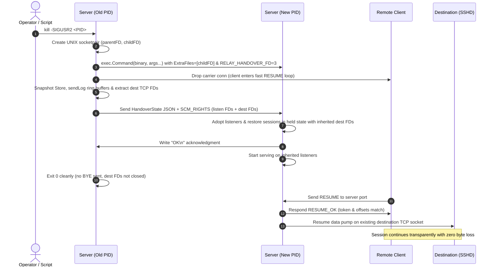

# FEAT-ROB-02: Zero-Downtime Server Restarts & Socket Handover (`LISTEN_FDS` / `SCM_RIGHTS`)

## 1. Executive Summary

As documented in [`README.md`](../README.md) and [`relay_feedback.md`](../relay_feedback.md) §5.1, `remote-relay` session hold state and destination TCP sockets live strictly in memory inside [`Server`](../internal/relay/server.go). Prior to **FEAT-ROB-02**, if the server process restarted for software upgrades or configuration updates, all active destination sockets were closed immediately. Reconnecting clients received `ERR_UNKNOWN_SESSION`, terminating developer SSH sessions.

**FEAT-ROB-02** introduces:
1. **Zero-Downtime Hot Re-Exec on `SIGUSR2`**: Seamless process handover where the parent server forks/executes the updated `relay server` binary without dropping connections.
2. **State & Socket Handover via `SCM_RIGHTS`**: Atomic transfer of listening sockets (`listen_tcp`, `udp_listen`) and connected destination TCP sockets (`l.dest`) over a Unix domain socket control message stream.
3. **Session State Deserialization & Resume**: Serialization and restoration of active session metadata (session IDs, token hashes, stream offsets, and unacknowledged downlink ring buffers).
4. **Systemd Socket Activation (`LISTEN_FDS`)**: Native adoption of systemd-managed file descriptors across service restarts.

---

## 2. Technical Architecture

### 2.1 Handover Sequence



### 2.2 IPC Handover Protocol (`SCM_RIGHTS`)

The IPC stream transmits a JSON header followed by file descriptors passed via `SCM_RIGHTS` ancillary data:

```json
{
  "v": 1,
  "timestamp": "2026-09-23T02:00:00Z",
  "has_listen_tcp": true,
  "has_listen_udp": true,
  "sessions": [
    {
      "id": "s-a1b2c3d4e5f6",
      "token_hash": "...",
      "prev_hash": "...",
      "has_prev": false,
      "destination": "127.0.0.1:22",
      "created_at": "...",
      "auth_method": "ssh-publickey",
      "auth_user": "dev",
      "fingerprint": "SHA256:...",
      "public_key": "...",
      "up_acked": 4096,
      "down_next": 8192,
      "up_closed": false,
      "down_closed": false,
      "send_log_base": 4096,
      "send_log_data": "<base64 encoded unacknowledged bytes>",
      "send_log_cap": 67108864,
      "remaining_hold_ms": 300000,
      "client_ip": "192.168.1.10",
      "has_dest_fd": true
    }
  ]
}
```

#### File Descriptor Array Order:
1. `listen_tcp` FD (if `has_listen_tcp == true`)
2. `listen_udp` FD (if `has_listen_udp == true`)
3. `dest` TCP socket FDs in sequential order corresponding to sessions where `has_dest_fd == true`.

---

## 3. Implementation Breakdown

### 3.1 Session Store & Ring Buffer Snapshotting
- [`internal/session/store.go`](../internal/session/store.go): `Snapshot()` and `Restore()` methods to serialize/deserialize session tokens and cryptographically validated key bindings.
- [`internal/session/ringbuf.go`](../internal/session/ringbuf.go): `Snapshot()` and `RestoreRing()` to preserve unacknowledged bytes in memory and restore exact base sequence numbers without allocation spikes.

### 3.2 Handover Engine (`internal/relay/handover.go`)
- `SendHandoverState(w io.Writer, unixConn *net.UnixConn, state HandoverState, fds []int) error`
- `ReceiveHandoverState(r io.Reader, unixConn *net.UnixConn) (*HandoverState, []*os.File, error)`
- Platform support: `handover_unix.go` (Linux / BSD / macOS) using `syscall.UnixRights` and `handover_windows.go` (graceful fallback).

### 3.3 Server Lifecycle & Re-Exec (`internal/relay/server.go`)
- `Server.HotRestart()`:
  - Invoked upon `SIGUSR2`.
  - Creates socketpair, spawns child process with `RELAY_HANDOVER_FD=3`.
  - Disconnects active client carriers so clients immediately trigger `RESUME`.
  - Packages listening sockets and active destination TCP connections (`l.dest`).
  - Disarms destination close in parent (`l.dest = nil`).
  - Transfers state via `SCM_RIGHTS` and waits for child ACK before exiting 0.
- Adoption in child:
  - Detects `RELAY_HANDOVER_FD` or `LISTEN_FDS`.
  - Adopts listening sockets and instantiates restored sessions in held state.

### 3.4 Systemd Socket Activation (`LISTEN_FDS`)
- Evaluates `LISTEN_PID == os.Getpid()` and `LISTEN_FDS >= 1`.
- FD 3 adopted as TCP listener; FD 4 adopted as UDP PacketConn.

---

## 4. Verification & Testing Strategy

1. **Unit Tests**:
   - `internal/session`: Snapshot and restore of ring buffers and session token maps.
   - `internal/relay`: Systemd `LISTEN_FDS` adoption tests with mocked environment variables.
   - `internal/relay`: `SCM_RIGHTS` socket handover round-trip serialization and deserialization.
2. **Integration / E2E Tests**:
   - Continuous bidirectional data transfer across server hot restart.
   - Send `SIGUSR2` during active session; verify child takes over, destination TCP connection is preserved, client resumes cleanly, and SHA-256 of transferred payload matches byte-for-byte.
3. **Real-World Live Integration Test (`scripts/test_live_hot_restart.py`)**:
   - Verified against a real `/usr/sbin/sshd` server daemon, real `/tmp/relay-live` binary, and real `/usr/bin/ssh` client with `ProxyCommand`.
   - **Test 1 (Live Interactive Shell Continuity)**:
     - Opened interactive OpenSSH shell through relay server on port 7443.
     - Executed pre-restart commands.
     - Sent `kill -SIGUSR2 <parent_pid>`.
     - Parent transferred listeners & destination TCP socket connected to sshd via `SCM_RIGHTS` IPC and exited with code 0.
     - Executed post-restart commands (`uname -s`, token echo) on the **same active SSH shell** without disconnection or reconnection.
   - **Test 2 (16 MiB In-Flight Streaming Transfer)**:
     - Streamed a 16 MiB pseudo-random binary payload across `ProxyCommand`.
     - Triggered `SIGUSR2` mid-transfer. Child adopted listeners and preserved destination TCP socket.
     - Transfer completed in 0.86s (18.57 MiB/s) with returncode 0 and SHA-256 byte-exact match (`78c0664962b1ff4ce0880d435fe9a3acb6ebf64bdbbf9ab8c7c95b4fcfdd6b5f`).
   - **Test 3 (Handover Protocol Log Verification)**:
     - Verified IPC handshake logs: `received signal for zero-downtime hot restart`, `spawned child process for hot restart`, `handover: adopted tcp listener`, `handover complete and acknowledged by child`, `exiting parent process cleanly after hot restart`, and `session resumed`.
