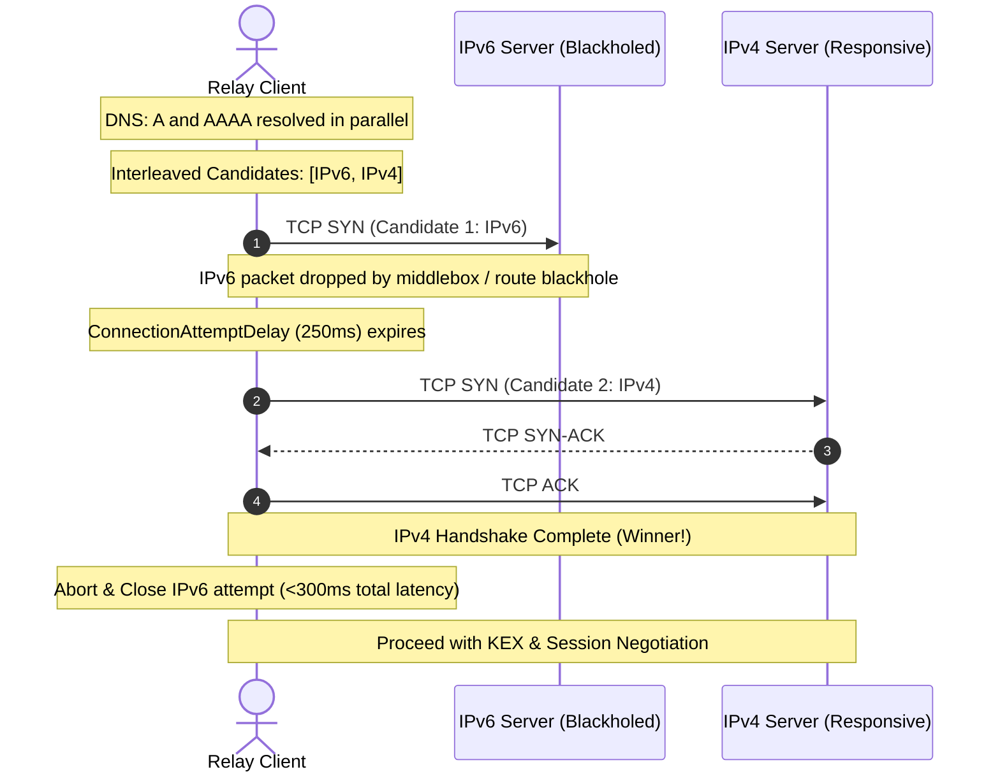
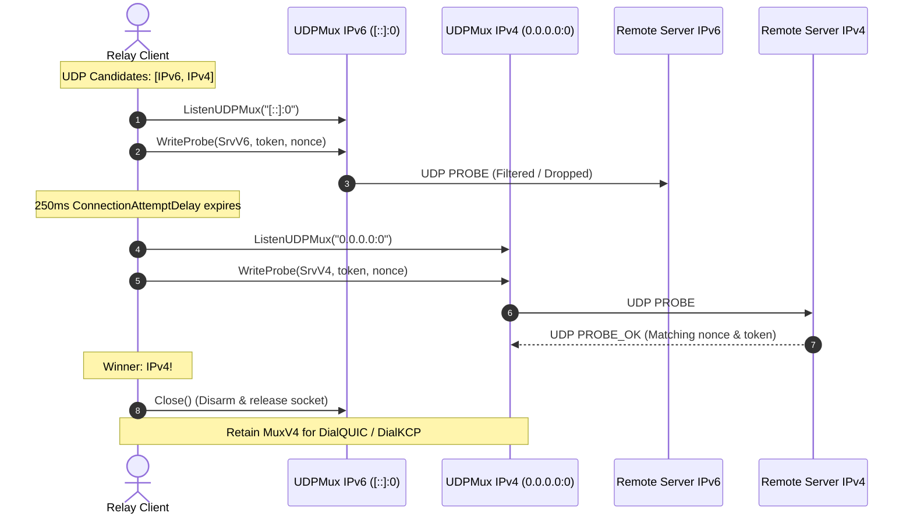

# FEAT-ROB-03: Dual-Stack Happy Eyeballs v2 (RFC 8305)

## 1. Executive Summary

In heterogeneous networking environments (mobile networks, enterprise VPNs, cloud VPCs, and dual-stack ISPs), IPv6 connectivity is frequently impaired by route filtering, misconfigured NAT64/DNS64 gateways, or silent packet blackholes. Currently, `remote-relay` client connection establishment in [`clientHello`](file:///root/remote-relay/internal/relay/client.go) and UDP probing in [`upgrade.go`](file:///root/remote-relay/internal/relay/upgrade.go) resolve server hostnames sequentially or use standard `net.Dial`, which attempts resolved IP addresses sequentially with long OS-level timeouts (up to 20–30 seconds).

Furthermore, when probing UDP endpoints for transport upgrades (QUIC and KCP), resolving a hostname via `net.ResolveUDPAddr` returns only a single IP address (whichever the OS resolver prefers). If that address family has UDP traffic dropped or blocked by middleboxes while the alternate family functions normally, UDP upgrade stalls and fails completely, forcing the client into degraded TCP transport or failing under strict UDP policies.

**FEAT-ROB-03** eliminates connection stalls and optimizes dual-stack latency by implementing **Happy Eyeballs Version 2 (RFC 8305)** across all client connection paths:
1. **Concurrent Dual-Stack DNS Resolution**: Queries both IPv6 (`AAAA`) and IPv4 (`A`) records in parallel with a standard 50ms `ResolutionDelay` and interleaves candidates (IPv6 preferred first).
2. **Staggered TCP Connection Racing**: Races TCP candidate dials with a configurable `ConnectionAttemptDelay` (default 250ms). The first socket to finish the TCP 3-way handshake wins immediately and becomes the active carrier, canceling all competing dials and closing their sockets.
3. **Dual-Stack UDP Probe Racing**: Probes candidate addresses concurrently across family-specific `UDPMux` instances (`[::]:0` and `0.0.0.0:0`). The first candidate to receive a valid `PROBE_OK` response wins; its `UDPMux` and remote address are adopted for QUIC/KCP dialing, while the loser's socket is immediately disarmed and closed.
4. **Resilience & Diagnostic Visibility**: If all candidates fail, returns an aggregated error via `errors.Join` containing diagnostics from every attempted IP address.

---

## 2. Technical Architecture & Protocols

### 2.1 Scope of Operation
Happy Eyeballs v2 applies to all client-initiated connection paths:
- **Initial Connection (`clientHello`)**: High-performance primary TCP connection to `cfg.Server`.
- **Session Resumption (`clientResume`)**: Rapid reconnection after transient network drops.
- **HA Standby Carrier (`standbyManager`)**: Concurrently maintaining standby TCP connection under `--allow-ha`.
- **UDP Carrier Upgrade (`tryUpgrade`)**: Probing UDP server reachability before dialing QUIC or KCP.

Server-to-destination backend TCP dialing in [`server.go`](file:///root/remote-relay/internal/relay/server.go) remains managed by standard `net.Dialer` with `DialTimeout`.

---

### 2.2 RFC 8305 Algorithm Implementation

#### A. Concurrent Address Resolution & Candidate Interleaving
When dialing or probing a destination host:
1. If the address is an IP literal (`127.0.0.1`, `::1`), skip DNS and dial directly.
2. If the address is a hostname:
   - Launch two concurrent lookups: `resolver.LookupIP(ctx, "ip6", host)` and `resolver.LookupIP(ctx, "ip4", host)`.
   - Implement RFC 8305 §3 `ResolutionDelay` (50ms): If IPv6 records are received first, wait up to 50ms for IPv4 records (or proceed immediately if both arrive).
   - Order candidates using RFC 8305 §5 interleaving: `[IPv6[0], IPv4[0], IPv6[1], IPv4[1], ...]`.

#### B. Staggered TCP Dial Racing (`internal/transport/happy.go`)
1. Initiate TCP dial to candidate 0 (`IPv6[0]`).
2. Arm a timer for `ConnectionAttemptDelay` (default 250ms).
3. If candidate 0 does not connect before the timer expires, initiate TCP dial to candidate 1 (`IPv4[0]`) in parallel.
4. Repeat for subsequent candidates if previous attempts remain unestablished.
5. **Winning Criterion**: The first socket to establish a completed TCP connection (3-way handshake `SYN-ACK`) wins:
   - Cancels all pending dial contexts and closes all competing sockets.
   - Wraps the winning socket via `transport.WrapTCP` and returns it for the cryptographic KEX/HELLO handshake.

---

### 2.3 Dual-Stack UDP Probe Racing (`internal/relay/upgrade.go`, `internal/transport/udpmux.go`)
UDP probing requires application-level confirmation (`PROBE` $\to$ `PROBE_OK` with cryptographic token and nonce) because UDP sockets are connectionless.

1. Resolve `udp.Addr` into interleaved candidates: `[IPv6[0], IPv4[0], ...]`.
2. Bind family-specific `UDPMux` sockets on demand:
   - For IPv6 candidates: bind `[::]:0`.
   - For IPv4 candidates: bind `0.0.0.0:0`.
3. Stagger probe datagrams:
   - Send `PROBE` to candidate 0 (`IPv6`).
   - If `PROBE_OK` is not received within `ConnectionAttemptDelay` (250ms), send `PROBE` to candidate 1 (`IPv4`).
4. The first candidate to receive a valid `PROBE_OK` wins:
   - Competing probe waiters are disarmed.
   - The losing `UDPMux` socket is immediately closed.
   - The winning `UDPMux` and winning remote `net.UDPAddr` are returned to `tryUpgrade`.
   - `DialQUIC` or `DialKCP` is initiated immediately on the winning `UDPMux`.

---

## 3. Configuration & CLI Flags

| Flag / Option | Type | Default | Description |
| :--- | :--- | :--- | :--- |
| `--happy-eyeballs-delay` | Duration | `250ms` | Stagger delay between racing connection and probe attempts (RFC 8305 `ConnectionAttemptDelay`). |
| `happy_eyeballs_delay` | Duration (TOML) | `250ms` | Client configuration option in `[client]` section. |
| Resolution Delay Constant | Constant | `50ms` | Maximum delay to wait for IPv4 DNS response when IPv6 arrives first (RFC 8305 §3). |

---

## 4. Verification & Testing Matrix

### 4.1 Unit Tests
- `TestHappyEyeballsResolver`: Parallel resolution, 50ms resolution delay timeout, and correct address interleaving.
- `TestHappyEyeballsTCPBothResponsive`: Both IPv6 and IPv4 responsive; assert IPv6 connects and wins.
- `TestHappyEyeballsTCPIPv6Blackhole`: IPv6 TCP blackholed; assert IPv4 establishes within $250\text{ms} + \text{RTT} < 300\text{ms}$.
- `TestHappyEyeballsUDPProbeRacing`: IPv6 UDP blocked; assert IPv4 UDP probe succeeds and returns valid `UDPMux` + `net.UDPAddr`.
- `TestHappyEyeballsAllFailedErrors`: When all endpoints fail, verify `errors.Join` returns composite diagnostic errors.

### 4.2 Dual-Netns Live Integration Tests (`scripts/test_happy_eyeballs.py`)
Run inside isolated network namespaces (`ns-srv` $\leftrightarrow$ `ns-cli`) with real OpenSSH `ProxyCommand`:
1. **`HE-01-Dual-Stack-Fast-V6`**: Both IPv6 and IPv4 reachable; verify connection establishes over IPv6 with zero fallback delay.
2. **`HE-02-IPv6-Blackhole-Fast-Fallback`**: Drop IPv6 TCP SYN packets via `ip6tables`; verify client connects over IPv4 with connection latency strictly $<300\text{ms}$ and completes 10 MiB payload transfer byte-exact.
3. **`HE-03-IPv4-Blackhole-V6-Direct`**: Drop IPv4 TCP SYN packets; verify client connects over IPv6 without delay.
4. **`HE-04-UDP-Probe-Racing-V6-Drop`**: Drop IPv6 UDP traffic; verify client probes IPv4, completes UDP upgrade, and transfers data over QUIC/KCP.
5. **`HE-05-Clean-Host-Teardown`**: Verify zero host networking pollution and clean namespace cleanup.
