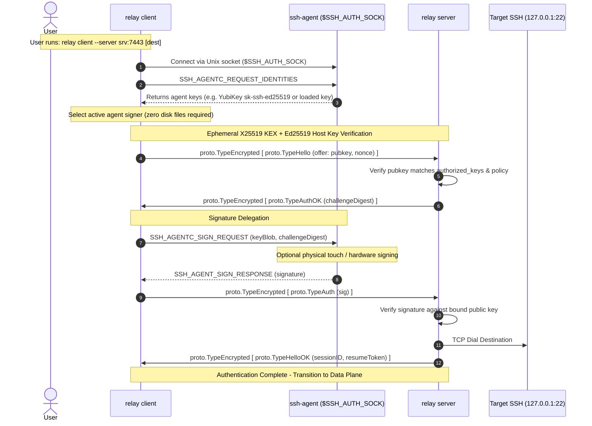
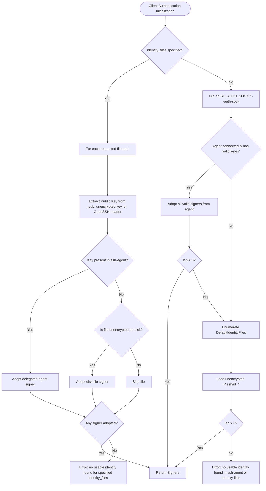

# FEAT-UTL-01: Native OpenSSH Agent (`SSH_AUTH_SOCK`) Integration

## 1. Executive Summary

Prior to FEAT-UTL-01, public-key authentication in `remote-relay` (`internal/auth/ssh.go`) operated exclusively by directly parsing unencrypted private keys from local disk files (`~/.ssh/id_ed25519`, `~/.ssh/id_ecdsa`, `~/.ssh/id_rsa`, or paths passed to `--identity/-i`). This created three significant operational limitations:
1. **Passphrase-Protected Keys**: Corporate security policies mandate passphrase protection on private keys stored on disk. When attempting to parse passphrase-protected private keys, the client failed with `ssh: cannot decode encrypted private keys` or dropped them silently.
2. **Missing `ssh-agent` Support**: Users could not leverage running `ssh-agent` sessions, requiring raw private keys to remain accessible on disk and unencrypted.
3. **Hardware Tokens & FIDO2 Security Keys**: Hardware security tokens (such as YubiKeys and FIDO2 keys using `sk-ssh-ed25519@openssh.com` or `sk-ecdsa-sha2-nistp256@openssh.com`) do not expose private key bytes on disk; their private operations must be performed via hardware delegation through `ssh-agent`.

**FEAT-UTL-01** resolves these limitations by delivering native OpenSSH Agent integration across the client control plane and authenticator stack:
- **Automatic Agent Discovery**: Inspects `$SSH_AUTH_SOCK` (or `--auth-sock` / `auth_sock` in configuration), connects to the local Unix domain socket, and enumerates available signers via `golang.org/x/crypto/ssh/agent`.
- **Hardware-Delegated Signature Operation**: When responding to the server's cryptographic challenge, the client delegates the signature directly to `agent.Sign(pubKey, digest)` (with `agent.SignatureFlagRsaSha256` for RSA keys). Raw private key material never touches client memory or disk.
- **Passphrase-Protected Disk Key Matching**: When `--identity/-i` specifies an encrypted key file on disk, `remote-relay` extracts the public key from the companion `.pub` file or from the OpenSSH key header and transparently matches it against active keys in `ssh-agent`, avoiding passphrase prompts.
- **Robust Fallback Chain**: Transparently attempts active `ssh-agent` keys first, falls back to unencrypted disk keys (`identity_files` or `DefaultIdentityFiles()`) if the agent is unavailable, empty, or unreachable, and emits clear diagnostics if no usable key is found.
- **Hardware Security Key Support**: Expands `checkKeyPolicy` and `allowedSigFormat` to accept `sk-ssh-ed25519@openssh.com` and `sk-ecdsa-sha2-nistp256@openssh.com`.
- **Synergy with FEAT-PERF-03**: Because [**FEAT-PERF-03**](FEAT-PERF-03.md) decoupled reconnection to 3 RTTs using AEAD token authorization, physical interaction (touch prompts) on hardware tokens is required only once during initial session setup (`HELLO`). Background reconnections and HA standby links proceed silently.

---

## 2. Architecture & Protocol Sequence

### 2.1 Initial Handshake & Delegated Agent Signature



### 2.2 Fallback Chain State Machine



---

## 3. Implementation Details

### 3.1 Package `internal/auth`
- **`Config` Extensions**:
  ```go
  type Config struct {
      Method         string
      User           string
      AuthorizedKeys string
      IdentityFiles  []string
      FailDelay      time.Duration
      AuthSock       string      // Unix domain socket for ssh-agent (defaults to $SSH_AUTH_SOCK)
      Agent          agent.Agent // Optional injected agent for testing
  }
  ```
- **`PublicKey` Agent Connection & Lifecycle**:
  - Added `agentConn io.Closer` field and implemented `Close() error` on `*PublicKey` to cleanly release Unix domain socket descriptors.
  - Added `connectAgent()` with fallback to `defaultAuthSock()`. If `RELAY_TEST_IDENTITY` is set without `RELAY_TEST_AUTH_SOCK`, host ambient `SSH_AUTH_SOCK` is safely bypassed to maintain hermetic test isolation.
- **Key Discovery & Extraction**:
  - `extractPublicKey(path string)`: Inspects companion `.pub` file first (`path + ".pub"`), then attempts unencrypted parsing (`ssh.ParsePrivateKey`), and finally uses `extractOpenSSHPublicKey` to parse the unencrypted public key header from passphrase-protected OpenSSH private key files (`openssh-key-v1`).
- **Policy Support**:
  - Extended `checkKeyPolicy` to accept `ssh.KeyAlgoSKED25519` and `ssh.KeyAlgoSKECDSA256`.
  - Added fallback parsing in `checkKeyPolicy` for RSA keys returned as `*agent.Key` (which do not directly implement `ssh.CryptoPublicKey`) by parsing `ssh.ParsePublicKey(pub.Marshal())`.
  - Extended `allowedSigFormat` to recognize `ssh.KeyAlgoSKED25519` and `ssh.KeyAlgoSKECDSA256`.

### 3.2 Package `internal/config`
- Added `AuthSock` field to `Client` (`toml:"auth_sock"`), `ClientOptions`, and `LoadClient`.
- Configured default empty string, allowing ambient `$SSH_AUTH_SOCK` to take effect when unset.

### 3.3 CLI Package `cmd/relay`
- Added `--auth-sock PATH` CLI flag and documentation to `runClient` and `usage()`.

### 3.4 Package `internal/relay`
- Updated `clientAuth(cfg config.Client)` to populate `AuthSock: cfg.AuthSock`.
- Updated `clientHello` and `clientResume` to check for `io.Closer` on the authenticator and ensure `defer c.Close()` cleanly terminates agent connections.

---

## 4. Verification & Testing Matrix

### 4.1 Automated Test Suite Coverage

| Test Case | Package | Description | Status |
|:---|:---:|:---|:---:|
| `TestPublicKeyWithAgentInjected` | `internal/auth` | Direct signing delegation using programmatic `agent.NewKeyring()` | **PASS** |
| `TestPublicKeyWithAgentUnixSocket` | `internal/auth` | Real Unix domain socket agent server with zero files on disk | **PASS** |
| `TestPublicKeyFallbackChain/AgentHasKeysTakesPrecedence` | `internal/auth` | Agent keys preferred over disk keys in default fallback chain | **PASS** |
| `TestPublicKeyFallbackChain/EmptyAgentFallsBackToFiles` | `internal/auth` | Empty agent falls back seamlessly to unencrypted disk files | **PASS** |
| `TestPublicKeyFallbackChain/UnreachableAgentFallsBackToFiles` | `internal/auth` | Stale/broken agent socket falls back transparently to disk files | **PASS** |
| `TestPublicKeyFallbackChain/NoSignerFoundFailsCleanly` | `internal/auth` | Clean error emitted when neither agent nor disk has usable keys | **PASS** |
| `TestPublicKeyWithPassphraseProtectedKeyAndAgent` | `internal/auth` | Passphrase-encrypted key matched against agent; authenticates without password prompt | **PASS** |
| `TestPublicKeyRSA2048FromAgent` | `internal/auth` | RSA 2048-bit key via agent with `SignatureFlagRsaSha256` | **PASS** |
| `TestPublicKeyAgentRejectsSmallRSA` | `internal/auth` | 1024-bit RSA key from agent correctly rejected by key policy | **PASS** |
| `TestPublicKeySKKeyPolicy` | `internal/auth` | Verifies key policy and signature formats for `sk-ssh-ed25519` and `sk-ecdsa` | **PASS** |
| `TestClientAuthViaAgentNoDiskFiles` | `internal/relay` | End-to-end client tunnel streaming 1000 chunks with zero files on disk | **PASS** |
| `TestClientAuthViaAgentPassphraseProtectedKey` | `internal/relay` | End-to-end client tunnel with passphrase key delegated to agent | **PASS** |
| `TestClientAuthAgentStaleSocketFallbackToDisk` | `internal/relay` | End-to-end client fallback to disk when `AuthSock` socket is broken | **PASS** |
| `TestClientAuthViaRealSSHAgentProcess` | `internal/relay` | End-to-end client with real Linux `/usr/bin/ssh-agent` and `ssh-add` | **PASS** |
| `TestClientAuthViaAgentResumeFastAndFallback` | `internal/relay` | Both Fast 3-RTT resume and cryptographic fallback recovery via agent | **PASS** |

### 4.2 Concurrency & Race Verification
The complete test suite was executed under the Go race detector (`go test -race ./...`):
- `internal/auth`: Passed with 0 race conditions.
- `internal/relay`: Passed with 0 race conditions.
- Whole codebase: 100% test pass.
