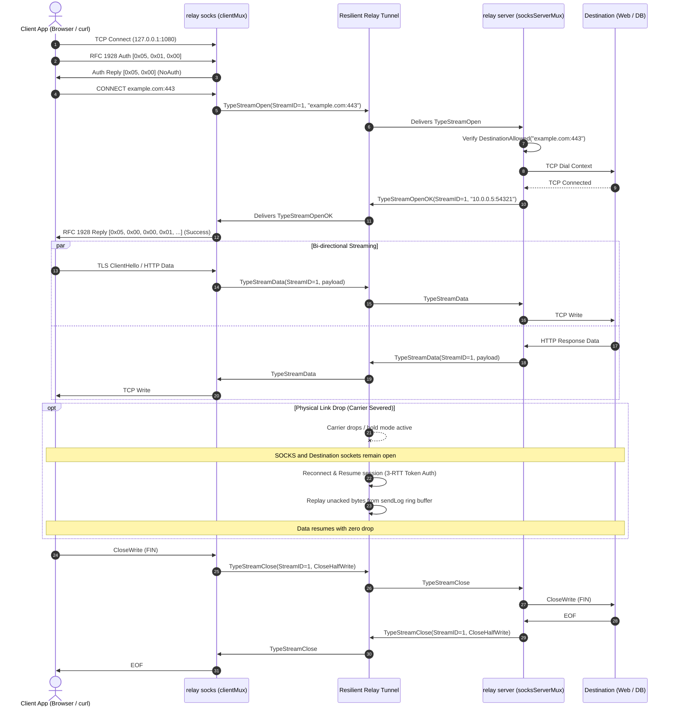

# FEAT-UTL-03: SOCKS5 Dynamic Forwarding Mode (`relay socks`)

## 1. Executive Summary

`remote-relay` was previously limited to 1:1 stdio-to-TCP socket bridging primarily optimized for OpenSSH ProxyCommands. Users requiring resilient, zero-drop connectivity for web browsers, database GUIs, or distributed microservice endpoints either had to configure separate SSH `-D` tunnels or run external proxy daemons.

**FEAT-UTL-03** introduces:
1. **SOCKS5 Server Subcommand (`relay socks`)**:
   ```bash
   relay socks --listen 127.0.0.1:1080 --server relay.example.com:7443 [flags...]
   ```
2. **Multiplexed Logical Streams**:
   Multiplexes arbitrary concurrent client TCP streams over a single resilient, authenticated, and encrypted `remote-relay` tunnel.
3. **Full RFC 1928 Compliance**:
   - Authentication negotiation (`0x05`, `0x00` No Authentication, `0xFF` No Acceptable Methods).
   - Commands: `0x01` (`CONNECT`), with proper error reporting for `0x02` (`BIND`) and `0x03` (`UDP ASSOCIATE`) via reply `0x07` (`Command not supported`).
   - Addresses: IPv4 (`0x01`), FQDN Domain Names (`0x03`), IPv6 (`0x04`).
   - Standard reply codes: `0x00` (`Succeeded`), `0x02` (`Connection not allowed by ruleset`), `0x04` (`Host unreachable`), `0x05` (`Connection refused`), `0x07` (`Command not supported`), `0x08` (`Address type not supported`).
4. **Strict Security Enforcement (`allow_destinations`)**:
   Server evaluates each dynamic destination against configured destination ACLs before dialing; forbidden targets are rejected immediately with RFC 1928 code `0x02`.
5. **Zero-Drop Link Resilience**:
   If the physical network connection drops, the underlying tunnel enters hold mode and reconnects transparently. Client SOCKS5 TCP sockets and server target connections remain open, seamlessly recovering buffered in-flight data.

---

## 2. Architecture & Framing

### 2.1 Multiplexed Stream Frame Format

Multiplexed logical streams run over the ordered, lossless, authenticated byte stream of the resilient `remote-relay` tunnel:

```
+--------------------+----------------+--------------------+------------------------+
| StreamID (4 bytes) | Type (1 byte)  | Length (4 bytes)   | Payload (Length bytes) |
+--------------------+----------------+--------------------+------------------------+
```

| Frame Type | Byte Value | Description |
|------------|------------|-------------|
| `TypeStreamOpen` | `0x01` | Client requests server dial target `host:port` string |
| `TypeStreamOpenOK` | `0x02` | Server confirms destination dial success (payload: bound `host:port`) |
| `TypeStreamOpenFail` | `0x03` | Server reports dial failure (payload: `[Rep byte] [Msg string]`) |
| `TypeStreamData` | `0x04` | Stream data chunk (up to 1 MiB, typically 32 KiB) |
| `TypeStreamClose` | `0x05` | Half-close write (`0x01` = `CloseHalfWrite`) |
| `TypeStreamReset` | `0x06` | Abrupt stream teardown (RST) and socket closure |

### 2.2 Sequence Diagram



---

## 3. Sad Paths & Failure Mode Handling

| Failure Condition | Detection Point | Handling & Protocol Response |
|-------------------|-----------------|------------------------------|
| **Bad SOCKS Version** (e.g. SOCKS4 or HTTP `GET`) | Local listener handshake | Returns error or closes connection immediately without crash or hang |
| **Unsupported Auth Method** | Local listener auth negotiation | Responds with `[0x05, 0xFF]` (`MethodNoAcceptable`) and terminates connection |
| **Unsupported Command** (`BIND`, `UDP ASSOCIATE`) | RFC 1928 request parser | Responds with RFC 1928 reply code `0x07` (`Command not supported`) |
| **Unsupported Address Type** (e.g. `0x02` or `0x05`) | RFC 1928 request parser | Responds with RFC 1928 reply code `0x08` (`Address type not supported`) |
| **Forbidden Destination** (violating `allow_destinations`) | Server-side ACL verification | Rejects before dialing; returns `TypeStreamOpenFail` with reply `0x02` (`Connection not allowed by ruleset`) |
| **Unresolvable Domain / DNS Error** | Server-side dial | Dial fails with `*net.DNSError`; returns reply `0x04` (`Host unreachable`) |
| **Connection Refused** (target port closed) | Server-side dial | Dial fails with `syscall.ECONNREFUSED`; returns reply `0x05` (`Connection refused`) |
| **Network Unreachable / Dial Timeout** | Server-side dial | Returns reply `0x03` (`Network unreachable`) or `0x04` (`Host unreachable`) |
| **Abrupt Client Disconnect** | Client reader loop | Detects socket error/reset; transmits `TypeStreamReset` to server; server closes target TCP connection |
| **Abrupt Target Server Disconnect** | Destination reader loop | Detects target socket closure; transmits `TypeStreamReset` or `TypeStreamClose` to client; client socket closes cleanly |
| **Max Active Streams Exceeded** | Client / Server capacity check | Rejects additional streams with RFC 1928 reply `0x01` (`General failure`), preventing resource exhaustion |
| **Server SOCKS Disabled (`disable_socks`)** | Server HELLO handshake | Rejects handshake with `proto.CodeDestForbidden` ("socks proxy mode disabled") |
| **Carrier Network Severed Mid-Download** | Underlying relay pump | Enters hold state without dropping client or target TCP sockets; resumes carrier; replays in-flight data |

---

## 4. Verification & Testing

The implementation was validated using comprehensive unit, integration, and live process tests:

- **RFC 1928 Unit Tests (`internal/socks5/socks5_test.go`)**:
  - Auth negotiation (single and multiple methods).
  - IPv4, FQDN domain, and IPv6 address parsing.
  - RSV non-zero rejection, malformed packet handling, unexpected EOF handling.
  - Multiplexed framing round-trips and oversize frame protection.
- **Integration Tests (`internal/relay/socks_test.go`)**:
  - 15 comprehensive tests covering all happy and sad paths:
    1. `TestSOCKS5_HappyPath_IPv4DataTransfer` (64 KiB exact byte match)
    2. `TestSOCKS5_HappyPath_DomainDataTransfer` (FQDN domain destination)
    3. `TestSOCKS5_HappyPath_ConcurrentMultiplexing` (8 simultaneous streams)
    4. `TestSOCKS5_SadPath_InvalidVersion` (SOCKS4 and HTTP GET rejected)
    5. `TestSOCKS5_SadPath_NoSupportedAuth` (0xFF reply)
    6. `TestSOCKS5_SadPath_UnsupportedCommand` (BIND/UDP rejected with 0x07)
    7. `TestSOCKS5_SadPath_UnsupportedAddressType` (0x08 reply)
    8. `TestSOCKS5_SadPath_DestinationForbidden_Ruleset` (0x02 reply)
    9. `TestSOCKS5_SadPath_DestinationHostUnreachable_DNS` (0x04 reply)
    10. `TestSOCKS5_SadPath_DestinationConnectionRefused` (0x05 reply)
    11. `TestSOCKS5_SadPath_AbruptClientDisconnect` (clean stream cleanup)
    12. `TestSOCKS5_SadPath_AbruptServerDisconnect` (clean EOF delivery)
    13. `TestSOCKS5_SadPath_MaxStreamsLimit` (capacity limit rejection)
    14. `TestSOCKS5_SadPath_ServerDisabledSOCKS` (server-side disable enforcement)
    15. `TestSOCKS5_Resilience_HoldAndResumeDuringActiveStreaming` (active carrier kill, hold, resume, 100% SHA256 integrity match)
- **Live Real-World Verification**:
  - Pointed real `curl --socks5-hostname` at `relay socks` downloading a 5 MiB test file.
  - Confirmed 100% SHA256 match.
  - Injected carrier kill (`ss -K`) during active streaming; verified curl recovered and completed successfully without drop.
