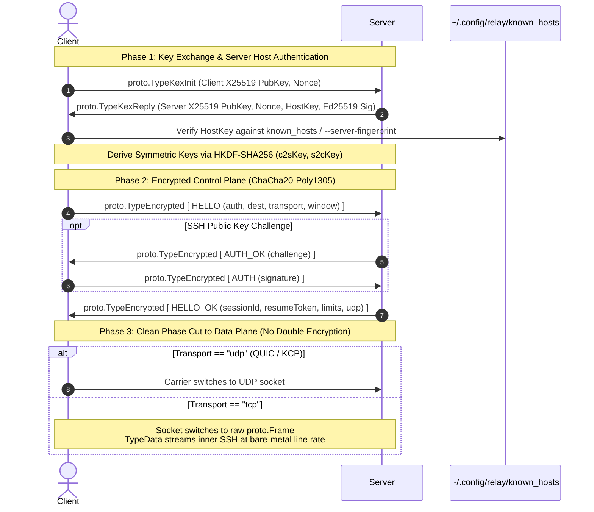

# FEAT-SEC-01: Encrypted Handshake Control Plane (SSH-Style X25519 & ChaCha20-Poly1305)

## 1. Executive Summary

In the current `remote-relay` architecture ([`design.md` §10.1](design.md)), the TCP control plane connection is conducted in cleartext JSON. Before a session is promoted or switched to a data carrier, `HELLO`, `HELLO_OK`, `AUTH`, `AUTH_OK`, `RESUME`, and `RESUME_OK` frames are sent in the clear.

Although inner application traffic (e.g. SSH) is independently encrypted end-to-end, the unencrypted control plane exposes sensitive metadata to on-path passive eavesdroppers and network middleboxes:
- Target destination endpoints (`host:port`).
- Ephemeral `sessionId` and sensitive `resumeToken` values (enabling token interception and session hijacking / DoS).
- User identity strings and authentication metadata.
- Cleartext JSON structure, making `remote-relay` traffic easily fingerprintable by Deep Packet Inspection (DPI) firewalls.

**FEAT-SEC-01** hardens the control plane with a high-performance, cryptographic handshake inspired by SSH and Noise:
1. **Ephemeral X25519 Diffie-Hellman Key Exchange**: Provides Forward Secrecy per connection.
2. **ChaCha20-Poly1305 AEAD Symmetric Control Cipher**: All control frames (`HELLO`, `RESUME`, `AUTH`, etc.) are authenticated and encrypted under derived 256-bit symmetric keys with 64-bit monotonically increasing sequence nonces.
3. **OpenSSH-Compatible Ed25519 Host Key & `known_hosts` Verification**: The server maintains an Ed25519 host key (auto-generated on first run if not present); the client verifies the server against `~/.config/relay/known_hosts` or a pinned `--server-fingerprint`, thwarting active Man-In-The-Middle (MITM) attacks.
4. **Option A Clean Phase Cut (Zero Double-Encryption Overhead)**: Encryption is applied strictly to the control handshake phase. Once `HELLO_OK` or `RESUME_OK` completes, the TCP socket transitions directly to raw transport framing for `proto.TypeData`. Because the carried SSH payload is already end-to-end encrypted, this completely eliminates double-encryption CPU overhead and maximizes throughput.
5. **Strict Encrypted-Only Enforcement**: Cleartext control handshakes are rejected unconditionally.

---

## 2. Technical Architecture & Protocols



---

### 2.1 Wire Framing & Frame Types

In `internal/proto/proto.go`, three new frame types are allocated:

```go
const (
    TypeKexInit   Type = 0x0B // Client -> Server: ephemeral public key + nonce
    TypeKexReply  Type = 0x0C // Server -> Client: ephemeral public key + nonce + host key + sig
    TypeEncrypted Type = 0x0D // Bidirectional: AEAD encrypted control frame
)
```

All frames adhere to the standard `remote-relay` frame format:
```text
 0                   1                   2                   3
 0 1 2 3 4 5 6 7 8 9 0 1 2 3 4 5 6 7 8 9 0 1 2 3 4 5 6 7 8 9 0 1
+-+-+-+-+-+-+-+-+-+-+-+-+-+-+-+-+-+-+-+-+-+-+-+-+-+-+-+-+-+-+-+-+
|   Type (1B)   |                 Length (4B)                   |
+-+-+-+-+-+-+-+-+-+-+-+-+-+-+-+-+-+-+-+-+-+-+-+-+-+-+-+-+-+-+-+-+
|                        Payload (Length B)                     |
+-+-+-+-+-+-+-+-+-+-+-+-+-+-+-+-+-+-+-+-+-+-+-+-+-+-+-+-+-+-+-+-+
```

#### 2.1.1 `TypeKexInit` Payload Format (48 Bytes Fixed)
- `ClientEphemeral` (32 bytes): Client's ephemeral Curve25519 (X25519) public key.
- `ClientNonce` (16 bytes): Cryptographically secure random bytes generated by the client.

#### 2.1.2 `TypeKexReply` Payload Format (144 Bytes Fixed)
- `ServerEphemeral` (32 bytes): Server's ephemeral Curve25519 (X25519) public key.
- `ServerNonce` (16 bytes): Cryptographically secure random bytes generated by the server.
- `ServerHostKey` (32 bytes): Server's Ed25519 public host key.
- `Signature` (64 bytes): Ed25519 signature by the server host key over the Exchange Hash $H$:

$$H = \text{SHA-256}(ClientEphemeral \parallel ServerEphemeral \parallel ClientNonce \parallel ServerNonce \parallel ServerHostKey)$$

#### 2.1.3 `TypeEncrypted` Payload Format (Variable Length)
- `SequenceNumber` (8 bytes, uint64 big-endian): Monotonically incremented per direction, starting at `0`.
- `Ciphertext + Tag` ($N + 16$ bytes): ChaCha20-Poly1305 AEAD ciphertext protecting the inner plaintext control frame:
  $$\text{Plaintext} = [\text{InnerType (1B)}] \parallel [\text{InnerLength (4B)}] \parallel [\text{InnerPayload}(N-5\text{B})]$$
- **AEAD Parameters**:
  - Key: 32 bytes (`Key_c2s` for client-to-server, `Key_s2c` for server-to-client).
  - Nonce: 12 bytes constructed as `[4 bytes 0x00] || [8 bytes SequenceNumber]`.
  - Additional Data (AD): 8-byte `SequenceNumber` (binds sequence number to the AEAD tag).

---

### 2.2 Key Derivation & HKDF

Upon receiving a valid `KexReply` and verifying the server's Ed25519 signature:
1. Both client and server compute the shared Diffie-Hellman secret $K$:
   $$K = \text{X25519}(PrivateEphemeral, RemoteEphemeral)$$
2. Pseudorandom Key (PRK) extraction:
   $$PRK = \text{HKDF-Extract}(\text{salt} = ClientNonce \parallel ServerNonce, \text{ikm} = K)$$
3. Symmetric keys expansion:
   $$Key_{c2s} = \text{HKDF-Expand}(PRK, \text{"relay/control/c2s"}, 32)$$
   $$Key_{s2c} = \text{HKDF-Expand}(PRK, \text{"relay/control/s2c"}, 32)$$

---

### 2.3 Server Host Key Lifecycle & `known_hosts` Verification

```
                      +-----------------------------+
                      | Client receives Server Host |
                      |    Public Key & Sig in KEX  |
                      +--------------+--------------+
                                     |
                                     v
                       /---------------------------\
                      /  Verify Signature over $H$  \
                      \          Valid?             /
                       \---------------------------/
                                     | Yes
                                     v
                      /-----------------------------\
                     /   --server-fingerprint set?   \
                     \                               /
                      \-----------------------------/
                        | Yes                     | No
                        v                         v
          +---------------------------+   +-------------------------------+
          | Compare SHA-256 hash with |   | Lookup [host]:port in client  |
          | pinned fingerprint        |   | ~/.config/relay/known_hosts   |
          +-------------+-------------+   +---------------+---------------+
                        |                                 |
         +--------------+--------------+                  |
         | Match                       | Mismatch         v
         v                             v    /---------------------------\
      [Proceed]                 [FATAL ERROR] /     Host entry found?     \
                                              \                           /
                                               \-------------------------/
                                                | Found               | Not found
                                                v                     v
                                  /---------------------------\   [TOFU Flow]
                                 /  Matches stored host key?   \  - If interactive: prompt user
                                 \                             /  - If yes: append to known_hosts
                                  \---------------------------/   - If mismatch: FATAL MITM ERROR
                                    | Yes                 | No
                                    v                     v
                                 [Proceed]          [FATAL ERROR]
```

#### Server Host Key:
- Located at `/etc/relay/ssh_host_ed25519_key` (configurable via `host_key` in `server.toml`).
- If missing at startup, auto-generated using `crypto/ed25519` and written to disk with `0600` permissions (and `.pub` with `0644`).
- Server logs the SHA-256 fingerprint on startup:
  ```text
  [INFO] Host key active: SHA256:4t7a0W9y... (ED25519) path=/etc/relay/ssh_host_ed25519_key
  ```

#### Client `known_hosts`:
- Standard OpenSSH format located at `~/.config/relay/known_hosts`:
  ```text
  [127.0.0.1]:7443 ssh-ed25519 AAAAC3NzaC1lZDI1NTE5AAAAICc3B4hU7...
  ```
- CLI flags:
  - `--server-fingerprint SHA256:...`: Explicit fingerprint pinning.
  - `--strict-host-key-checking=yes|no|ask` (defaults to `ask` for TTY, `yes` for headless scripts).

---

### 2.4 Option A: Clean Phase Cut Transition

1. All control messages (`HELLO`, `HELLO_OK`, `AUTH`, `AUTH_OK`, `RESUME`, `RESUME_OK`, `FAIL`) are strictly encrypted inside `TypeEncrypted` frames.
2. The control phase ends immediately upon:
   - Client processing a valid `HELLO_OK` or `RESUME_OK`.
   - Server sending `HELLO_OK` or `RESUME_OK`.
3. Transition execution:
   - The underlying `transport.Conn` transitions out of the AEAD frame wrapper into the unencrypted frame codec (`proto.ReadFrame` / `proto.WriteFrame`).
   - If TCP data transport is used, subsequent frames (`proto.TypeData`, `proto.TypeAck`, `proto.TypePing`, `proto.TypeCloseDir`) are processed without AEAD wrapping.
   - The inner SSH stream provides end-to-end security. CPU overhead from duplicate encryption is completely eliminated.
4. When a session disconnects, any subsequent `RESUME` attempt initiates a fresh TCP connection and executes a new encrypted KEX handshake.

---

## 3. Component Architecture & Changes

### 3.1 New Package: `internal/crypto/kex`
A dedicated cryptographic package implementing the handshake primitives:
- `kex.go`:
  - `ClientSession`: Generates ephemeral X25519 key, builds `TypeKexInit`, validates `TypeKexReply`, verifies server signature, derives symmetric keys.
  - `ServerSession`: Processes `TypeKexInit`, generates ephemeral X25519 key, signs transcript with Ed25519 host key, derives symmetric keys.
- `aead.go`:
  - `CipherConn`: Wraps an underlying `transport.Conn`, providing `ReadEncryptedFrame()` and `WriteEncryptedFrame()` with sequence-based ChaCha20-Poly1305.
- `hostkey.go`:
  - `LoadOrGenerateHostKey(path string)`: Reads or creates standard OpenSSH Ed25519 private key.
  - `FingerprintSHA256(pub ed25519.PublicKey) string`: Computes standard OpenSSH SHA-256 fingerprint.
  - `VerifyKnownHosts(knownHostsPath, addr string, pub ed25519.PublicKey, tofuPolicy string) error`.

### 3.2 Protocol Layer (`internal/proto`)
- Add `TypeKexInit` (`0x0B`), `TypeKexReply` (`0x0C`), `TypeEncrypted` (`0x0D`) to `proto.go`.
- Update `Type.Known()` and `Type.String()`.
- Add encoders and decoders in `internal/proto/codec.go` for fixed-size KEX frames.

### 3.3 Configuration (`internal/config`)
- **Server**:
  - `HostKey string` (`host_key`, default `/etc/relay/ssh_host_ed25519_key` or `~/.config/relay/host_key`).
- **Client**:
  - `KnownHosts string` (`known_hosts`, default `~/.config/relay/known_hosts`).
  - `ServerFingerprint string` (`server_fingerprint`).
  - `StrictHostKeyChecking string` (`strict_host_key_checking`, default `ask`).
- **CLI Flags** in `cmd/relay`:
  - `--host-key` (server)
  - `--known-hosts` (client)
  - `--server-fingerprint` (client)
  - `--strict-host-key-checking` (client)

### 3.4 Server Connection Pipeline (`internal/relay/server.go`)
- `Server.handle(raw net.Conn)`:
  - First frame read MUST be `TypeKexInit`. Any other frame type (e.g. legacy cleartext `TypeHello` or `TypeResume`) immediately returns `proto.CodeProto` or drops the connection.
  - Server completes KEX, sends `TypeKexReply`, derives symmetric keys, and constructs `CipherConn`.
  - Server reads encrypted `TypeHello` or `TypeResume`.
  - Upon sending `TypeHelloOK` or `TypeResumeOK`, server flushes the encrypted writer and unpacks the raw connection for `pump.go`.

### 3.5 Client Connection Pipeline (`internal/relay/client.go`)
- `clientHello` and `clientResume`:
  - Dial TCP.
  - Perform `TypeKexInit` $\to$ `TypeKexReply` exchange.
  - Verify server host key against `known_hosts` or `--server-fingerprint`.
  - Wrap connection in `CipherConn`.
  - Send encrypted `TypeHello` / `TypeResume` and receive encrypted `TypeHelloOK` / `TypeResumeOK`.
  - Return raw connection for data pump streaming.

---

## 4. Implementation Phasing & Step-by-Step Tasks

```
Phase 1: Cryptographic Engine & Host Key Management
├── Task 1.1: Create internal/crypto/kex package (X25519 key exchange & HKDF-SHA256)
├── Task 1.2: Implement ChaCha20-Poly1305 AEAD framing (CipherConn with 64-bit sequence counters)
├── Task 1.3: Implement OpenSSH Ed25519 host key loader, generator, and fingerprint calculation
└── Task 1.4: Implement known_hosts parsing, verification, and TOFU store

Phase 2: Protocol Framing Updates
├── Task 2.1: Add TypeKexInit, TypeKexReply, and TypeEncrypted to internal/proto
├── Task 2.2: Implement binary serialization for KEX payloads
└── Task 2.3: Add proto unit tests for KEX and Encrypted frame codecs

Phase 3: Configuration & CLI Flags
├── Task 3.1: Add host_key to config.Server and known_hosts/server_fingerprint to config.Client
├── Task 3.2: Wire CLI flags in cmd/relay/main.go
└── Task 3.3: Update config tests to validate defaults and overrides

Phase 4: Relay Pipeline Integration (Server & Client)
├── Task 4.1: Integrate KEX and AEAD control plane into internal/relay/server.go
├── Task 4.2: Enforce encrypted-only mode on server (drop unencrypted handshakes)
├── Task 4.3: Integrate KEX and AEAD control plane into internal/relay/client.go
└── Task 4.4: Implement Option A Clean Phase Cut transition to raw framing for pump.go

Phase 5: Verification & End-to-End Tests
├── Task 5.1: Unit tests for KEX transcript validation, invalid signatures, replay attacks
├── Task 5.2: E2E tests for client-server handshake, known_hosts mismatch rejection, and reconnect
├── Task 5.3: Packet capture verification (assert zero plaintext strings in tcpdump inspection)
└── Task 5.4: Update features.md status to Implemented
```

---

## 5. Verification & Test Strategy

### 5.1 Unit Tests
1. **`internal/crypto/kex/kex_test.go`**:
   - `TestKexHandshakeSuccess`: Validates shared secret convergence and matching derived keys.
   - `TestKexInvalidSignature`: Validates rejection when signature does not match transcript.
   - `TestAEADSequenceReplay`: Injects out-of-order or duplicate sequence numbers; asserts decryption failure.
2. **`internal/crypto/kex/hostkey_test.go`**:
   - `TestHostKeyAutoGeneration`: Tests key generation, file permissions (`0600`), and fingerprint formatting.
   - `TestKnownHostsVerification`: Tests known host match, mismatch (MITM trigger), and TOFU appending.

### 5.2 Integration & E2E Tests (`internal/relay/sec_test.go`)
1. **`TestEncryptedHandshakeEndToEnd`**: Client and server complete handshake and transfer data over TCP.
2. **`TestEncryptedHandshakeRejectPlaintext`**: Plaintext `HELLO` sent to server is rejected with error.
3. **`TestHostKeyMismatchAborts`**: Client with outdated `known_hosts` entry rejects server connection immediately.
4. **`TestPacketInspectionZeroPlaintext`**:
   - Intercept TCP handshake bytes using a virtual pipe recorder.
   - Assert that ASCII substrings `"HELLO"`, `"sessionId"`, `"resumeToken"`, and destination strings NEVER appear in the raw bytes.
