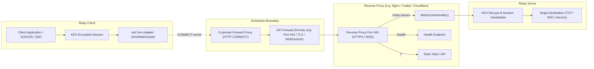

# FEAT-SEC-02: WebSocket & HTTPS Port 443 Fallback Transport

## 1. Executive Summary

In enterprise, government, and campus network environments, strict egress firewalls and Deep Packet Inspection (DPI) middleboxes routinely block raw TCP traffic to non-standard ports and drop UDP packets (preventing direct QUIC and KCP connections). To guarantee connectivity in these hostile or highly constrained network topologies, **FEAT-SEC-02** introduces a WebSocket and HTTPS Port 443 fallback transport adapter.

Key capabilities delivered by **FEAT-SEC-02**:
- **Standard RFC 6455 WebSocket Framing**: Full bidirectional binary framing (`websocket.BinaryFrame`) over standard HTTP/1.1 and HTTPS connections.
- **Port 443 & Reverse Proxy Multiplexing**: Relay server exposes WebSocket endpoints (`listen_ws` / `websocket_path`) that can run directly on TLS port 443 or sit behind reverse proxies (Nginx, Caddy, Cloudflare, Traefik, AWS ALB) alongside existing web applications (e.g., path multiplexing `/relay-stream` and `/health`).
- **Enterprise HTTP CONNECT Proxy Traversal**: Transparent traversal of corporate outbound HTTP/HTTPS proxies using standard environment variables (`HTTP_PROXY`, `HTTPS_PROXY`, `ALL_PROXY`, `NO_PROXY`), including `CONNECT` tunnels with `Proxy-Authorization: Basic` support and safe buffer preservation.
- **Reverse Proxy Header Extraction**: Automatic extraction of real client IPs from `X-Forwarded-For` and `X-Real-IP` headers so rate limiting, IP connection limits (`max_conns_per_ip`), and audit logs remain accurate behind reverse proxies.
- **End-to-End Cryptographic Security**: Seamlessly integrates with [FEAT-SEC-01](FEAT-SEC-01.md) mandatory KEX handshakes, host key verification, pinned fingerprints, and session resumption over WebSocket streams.
- **Full Chaining Support**: Seamlessly participates in multi-hop jumphost chains (`-J hop1?transport=ws,hop2`) allowing arbitrary hops to use WebSocket transports.

---

## 2. Architecture & Design

### 2.1 Transport Architecture



### 2.2 WebSocket Transport Adapter (`internal/transport/websocket.go`)

- **`KindWebSocket`**: Added to [`transport.Kind`](../../internal/transport/conn.go) (`Kind.String()` returns `"ws"`).
- **`wsConn`**: Wraps underlying `*websocket.Conn` satisfying the [`transport.Conn`](../../internal/transport/conn.go) interface. Reads and writes binary frames via buffered I/O (`*bufio.Reader` and `*bufio.Writer`).
- **Thread Safety**: Writes in `WriteFrame` flush buffered data synchronously. `Close()` closes the underlying connection without racing concurrent frame writes.
- **DialWebSocket**:
  - Parses `ws://`, `wss://`, `http://`, or `https://` URLs.
  - Automatically infers standard default ports (`80` for `ws`/`http`, `443` for `wss`/`https`) when ports are omitted from target URLs.
  - Resolves proxy settings via `http.ProxyURL` / `ProxyFromEnvironment`.
  - When proxying, dials the proxy via [`DialTCPWithDelayAndBind`](../../internal/transport/tcp.go), performs standard HTTP `CONNECT` handshake with base64 `Proxy-Authorization` headers, extracts any buffered bytes from `bufio.Reader`, and completes the WebSocket handshake directly over the established tunnel.
  - Negotiates TLS via `crypto/tls` if `wss://` or `https://` scheme is specified, supporting custom `TLSConfig` and `--tls-insecure` flag for self-signed certificates.

### 2.3 Server-Side WebSocket Listener (`internal/relay/ws_server.go`)

- **`WebSocketHandler()`**: Returns an `http.Handler` routing configured `websocket_path` (default `/relay-stream`) to `websocket.Handler` and `/health` to a lightweight status check. This handler can be mounted directly onto any existing HTTP/HTTPS server or multiplexer.
- **Standalone `listen_ws`**: Server supports configuring `listen_ws` (`ws://host:port` or `wss://host:port` or `host:port`).
- **TLS Termination**: When `wss_cert` and `wss_key` are specified, or if `wss://` scheme is used, the server loads the TLS certificate pair or generates an ephemeral development certificate, serving HTTPS directly on the configured address.
- **Shared Session Ingestion**: Incoming WebSocket connections are wrapped in `WrapWebSocket` with forwarded client IP and passed directly to `Server.handleTransportConn()`, sharing identical authentication, RBAC policy checks, and I/O pump routines with standard TCP sessions.

### 2.4 Forwarded Client IP Extraction

When operating behind reverse proxies, `req.RemoteAddr` will point to the proxy's internal loopback or gateway IP. `internal/transport/websocket.go` implements:
- `ExtractClientIP(r *http.Request, trustedProxies []string)`: Checks `X-Forwarded-For` (taking the client-most IP) and falls back to `X-Real-IP` before using `r.RemoteAddr`.
- `ExtractRemoteAddr(r *http.Request, trustedProxies []string)`: Produces a `net.Addr` with the actual client IP and original remote port for per-IP rate limiting and connection tracking.

---

## 3. Configuration & CLI Reference

### 3.1 Client Configuration

In `client.toml`:
```toml
server = "wss://relay.example.com/relay-stream"
transport = "ws"
websocket_path = "/relay-stream"
tls_insecure = false
```

CLI Flags:
| Flag | Description | Default |
|---|---|---|
| `--ws` | Use WebSocket transport (`ws://` or `wss://`) | `false` |
| `--websocket-path <path>` | URL path for WebSocket endpoint | `"/relay-stream"` |
| `--insecure`, `--tls-insecure` | Skip TLS certificate verification | `false` |

URL Address Formats:
- `--server ws://relay.example.com:8080/relay-stream`
- `--server wss://relay.example.com:443/relay-stream`
- `--server https://relay.example.com/relay-stream` (infers `wss://` on port 443)
- `-J "wss://jump1.example.com/relay-stream,jump2:2222"`

### 3.2 Server Configuration

In `server.toml`:
```toml
listen_ws = "0.0.0.0:8443"
websocket_path = "/relay-stream"
ws_cert = "/etc/relay/cert.pem"
ws_key = "/etc/relay/key.pem"
```

CLI Flags:
| Flag | Description | Default |
|---|---|---|
| `--listen-ws <addr>` | Address/port to listen for incoming WebSocket connections | `""` |
| `--websocket-path <path>` | Endpoint path for WebSocket handshake | `"/relay-stream"` |

---

## 4. Verification & Testing

### 4.1 Unit & Integration Test Coverage
- **`internal/transport/websocket_test.go`**:
  - `TestWebSocketDirect_HappyPath`: Direct unencrypted WebSocket frame round-trip.
  - `TestWebSocketTLS_HappyAndSadPaths`: TLS handshake success with ephemeral certs and strict verification failure rejection.
  - `TestWebSocketProxy_HappyPath`: Outbound HTTP `CONNECT` forward proxy tunneling.
  - `TestWebSocketProxy_WithBasicAuth`: Forward proxy authentication with base64 credentials.
  - `TestWebSocketProxy_RefusalAndBadGateway`: Handling proxy 403 Forbidden and 502 Bad Gateway responses.
  - `TestWebSocket_InvalidUpgradeResponse`: Server returning 404 or bad upgrade status.
  - `TestWebSocket_ClientIPExtraction`: Validating `X-Forwarded-For` and `X-Real-IP` parsing.
  - `TestWebSocket_DeadlineAndResetReader`: Read deadlines and stream buffer resets.
- **`internal/relay/ws_test.go`**:
  - `TestRelayWebSocket_DirectE2E`: End-to-end client-server relay data streaming over WebSocket.
  - `TestRelayWebSocket_TLSE2E`: End-to-end encrypted relay streaming over WSS.
  - `TestRelayWebSocket_ReverseProxyMultiplexing`: Mounting `WebSocketHandler()` inside standard reverse proxy multiplexer with `/health` endpoint verification.
  - `TestRelayWebSocket_HTTPProxyTunneling`: End-to-end relay client communicating through a forward HTTP CONNECT proxy.
  - `TestRelayWebSocket_JumphostChaining`: Multi-hop chain using WebSocket on hop 1 and TCP on hop 2.
  - `TestRelayWebSocket_Resumption`: Re-establishing an interrupted session over WebSocket via session tokens and ack tracking.
  - `TestRelayWebSocket_HostKeyVerification`: Ed25519 host key pinning and strict verification over WebSocket URLs.
  - `TestRelayWebSocket_SadPaths`: Unreachable endpoints and invalid TLS certificates.

All tests execute cleanly under `go test -race ./...` with zero detected race conditions.
