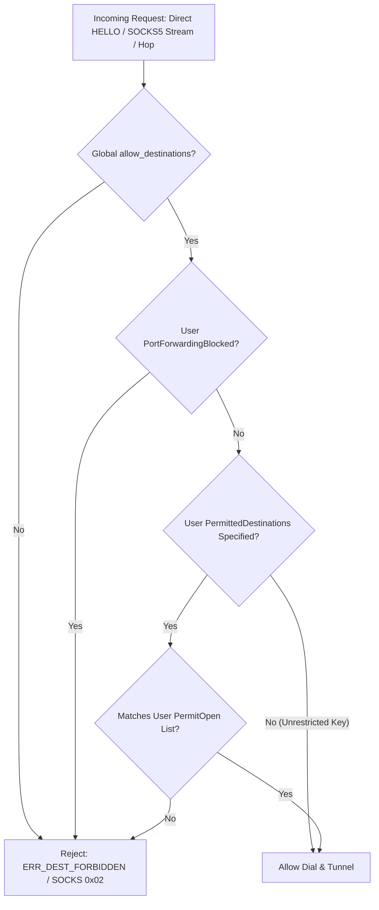

# FEAT-SEC-03: Per-User RBAC & Live `SIGHUP` Configuration Reload

## 1. Executive Summary

Prior to **FEAT-SEC-03**, `remote-relay` had two significant operational and security limitations:
1. **Single Global Destination Policy**: [`allow_destinations`](../../internal/config/config.go) was a global ACL. Any authenticated key possessed full access to all allowed destinations. Enterprise multi-tenant deployments could not restrict specific keys to particular bastion hosts, microservices, or admin ports.
2. **Cold Restarts Required for Policy Changes**: Adding or removing authorized user keys or updating allowed destinations required restarting the server daemon, dropping all active sessions, or triggering a process handover.

**FEAT-SEC-03** delivers:
- **Per-User RBAC in `authorized_keys`**: Standard OpenSSH options parsing (`permitopen="host:port"`, `permitopen="none"`, `no-port-forwarding`, `restrict`, `port-forwarding`).
- **Multi-Level Security Policy Enforcement**: Enforces RBAC across direct `HELLO` tunnels, individual multiplexed SOCKS5 logical streams (`relay socks`), and intermediate jumphost chaining hops.
- **Zero-Downtime Live `SIGHUP` Reload**: Unix `syscall.SIGHUP` signal handler atomically reloads `server.toml` and `authorized_keys` without dropping active connections, interrupting in-flight data, or restarting TCP/UDP listeners.
- **Fail-Closed Resilience**: Corrupted TOML configurations or invalid/empty `authorized_keys` files on disk log detailed errors and fail closed, safely preserving running in-memory configurations without crashing or degrading active sessions.

---

## 2. Technical Specification & Design

### 2.1 OpenSSH `authorized_keys` Options Format

Each entry in `authorized_keys` can optionally specify comma-delimited options prior to the public key type and base64 key material:

```text
permitopen="127.0.0.1:22",permitopen="10.0.0.*:8080" ssh-ed25519 AAAAC3NzaC1lZDI1NTE5... alice@corp
no-port-forwarding ssh-ed25519 AAAAC3NzaC1lZDI1NTE5... bob@contractor
restrict,port-forwarding,permitopen="192.168.1.50:443" ssh-ed25519 AAAAC3NzaC1lZDI1NTE5... service@ci
```

#### Supported Directives:
| Directive | Semantics |
|---|---|
| `permitopen="host:port"` | Restricts key to dialing the specified destination. Multiple directives accumulate as an allowlist. Supports wildcards (`*:port`, `host:*`, `10.0.0.0/8:*`, `*.example.com:443`). |
| `permitopen="none"` | Completely blocks port forwarding for this key. HELLO and SOCKS5 attempts fail with `ERR_DEST_FORBIDDEN`. |
| `no-port-forwarding` | Explicitly disables all port forwarding for this key. |
| `restrict` | Disables all capabilities (equivalent to `no-port-forwarding`). |
| `port-forwarding` | Re-enables port forwarding when preceded by `restrict`. |

### 2.2 Security Policy Enforcement Points

Enforcement is applied hierarchically:
1. **Global Server ACL**: Destination must first pass the server's `allow_destinations` policy.
2. **Per-Key Port Forwarding Status**: If the identity has `PortForwardingBlocked: true` (via `no-port-forwarding`, `permitopen="none"`, or `restrict`), all destination requests are rejected with wire error `ERR_DEST_FORBIDDEN`.
3. **Per-Key Destination Allowlist**: If `PermittedDestinations` is non-empty, the destination must match at least one permitted pattern.



- **Direct HELLO (`handleHello`)**: Evaluated immediately after cryptographic key verification and before TCP dial to target destination.
- **SOCKS5 Mode (`handleOpen`)**: Initial `HELLO` with `proto.DestSOCKS5` checks that port forwarding is not blocked. Every individual stream open (`TypeStreamOpen`) dynamically verifies the dialed target against both the global ACL and the user's `PermittedDestinations`. Denied streams return RFC 1928 reply `0x02` (`Connection not allowed by ruleset`) while the underlying tunnel stays healthy.
- **Jumphost Chaining (`handleChain`)**: Chained hops check hop destination against the user's RBAC policy before dialing intermediate relays.

---

## 3. Atomic Live `SIGHUP` Reload Architecture

On Unix platforms (`server_unix.go`), the server process intercepts `syscall.SIGHUP` via `signal.Notify`:

```mermaid
sequenceDiagram
    autonumber
    actor Admin as Sysadmin / Deployment
    participant Sig as OS Signal Dispatcher
    participant Srv as Relay Server (server_unix.go)
    participant Disk as Disk (server.toml / authorized_keys)
    participant Active as Active Established Sessions

    Active->>Active: Continuous bi-directional streaming
    Admin->>Sig: kill -HUP $PID (SIGHUP)
    Sig->>Srv: Signal notification channel
    Srv->>Disk: LoadServer(opts) & LoadAuthorizedKeyEntries()
    alt Parse or Validation Error (Corrupt TOML / Empty Keys)
        Disk-->>Srv: Return error
        Srv->>Srv: Log error; keep existing atomic pointer and auth state
    else Valid Configuration
        Disk-->>Srv: Return new Server config & valid entries
        Srv->>Srv: s.cfgPtr.Store(&newCfg)
        Srv->>Srv: s.setAuth(newAuth)
        Srv->>Srv: Update logger level/format if changed
        Srv->>Srv: Log successful reload with key count & policies
    end
    Note over Active: Active sessions remain completely unaffected
    Admin->>Srv: New Client Connects (adopts updated policy immediately)
```

### In-Memory Configuration & Key Caching
- `Server.Config()` returns a copy loaded from `s.cfgPtr.Load() atomic.Pointer[config.Server]`.
- `auth.PublicKey` stores parsed `entries []AuthorizedKeyEntry` in memory. Handshakes perform in-memory comparisons without touching the filesystem.
- On SIGHUP, `auth.New()` constructs a new authenticator with freshly parsed in-memory entries, and atomically swaps it using `s.setAuth(newAuth)`.

---

## 4. Verification & Testing Matrix

Implementation and tests strictly verify both happy paths and extensive sad paths:

| Test Case | Scenario / Condition | Expected Behavior | Status |
|---|---|---|:---:|
| `TestRBAC_DirectPermitOpen_AllowedAndForbidden` | Key with `permitopen="dest1"` connects to `dest1` | Connection succeeds; transfers bytes | PASS |
| `TestRBAC_DirectPermitOpen_AllowedAndForbidden` | Key with `permitopen="dest1"` connects to `dest2` | Fails with `proto.ErrDestForbidden` | PASS |
| `TestRBAC_DirectPermitOpen_AllowedAndForbidden` | Key with `permitopen="127.0.0.1:*"` wildcard port | Connects to any port on 127.0.0.1 | PASS |
| `TestRBAC_Restrictions_NoPortForwarding_And_PermitOpenNone` | Key with `no-port-forwarding` connects | Rejected with `proto.ErrDestForbidden` | PASS |
| `TestRBAC_Restrictions_NoPortForwarding_And_PermitOpenNone` | Key with `permitopen="none"` connects | Rejected with `proto.ErrDestForbidden` | PASS |
| `TestRBAC_Restrictions_NoPortForwarding_And_PermitOpenNone` | Key with `restrict` connects | Rejected with `proto.ErrDestForbidden` | PASS |
| `TestRBAC_Restrictions_NoPortForwarding_And_PermitOpenNone` | Key with `restrict,port-forwarding,permitopen="..."` | Port forwarding re-enabled for permitted dest | PASS |
| `TestRBAC_SOCKS5_StreamEnforcement` | SOCKS5 tunnel with `no-port-forwarding` key | Rejected during HELLO handshake | PASS |
| `TestRBAC_SOCKS5_StreamEnforcement` | SOCKS5 tunnel with restricted key dials allowed target | Stream opened; full data echo transfer | PASS |
| `TestRBAC_SOCKS5_StreamEnforcement` | SOCKS5 tunnel with restricted key dials forbidden target | Stream rejected with RFC 1928 `0x02` | PASS |
| `TestRBAC_SIGHUP_LiveReload_AddKeyAndAllowDests` | Add key & dest to config + `ReloadConfig()` | Key connects immediately; active session intact | PASS |
| `TestRBAC_SIGHUP_KeyRevocation` | Remove key from `authorized_keys` + `ReloadConfig()` | Subsequent connections fail with `ERR_AUTH` | PASS |
| `TestRBAC_SIGHUP_SadPath_CorruptConfigOrAuthKeys` | Reload with malformed TOML file | Reload errors; server retains old config | PASS |
| `TestRBAC_SIGHUP_SadPath_CorruptConfigOrAuthKeys` | Reload with empty `authorized_keys` file | Reload errors; old keys still authenticate | PASS |
| `TestRBAC_Chain_HopDestinationPolicy` | Chained jumphost hop to forbidden target | Rejected with `proto.ErrDestForbidden` | PASS |
| `TestRBAC_SIGHUP_HighConcurrency_Race` | 10 concurrent clients while reloading 10 times | Zero race conditions under `-race` | PASS |
| `TestRBAC_OS_SIGHUP_SignalDispatch` | Real OS signal `syscall.Kill(pid, SIGHUP)` | Signal caught; new key accepted | PASS |

---

## 5. Artifacts and Modified Files

- [`internal/auth/auth.go`](../../internal/auth/auth.go): Extended `Identity` with `PortForwardingBlocked bool` and `PermittedDestinations []string`.
- [`internal/auth/ssh.go`](../../internal/auth/ssh.go): Implemented `AuthorizedKeyEntry`, `ParseAuthorizedKeyOptions`, `LoadAuthorizedKeyEntries`, in-memory `entries` caching, and option validation in `Verify()`.
- [`internal/config/config.go`](../../internal/config/config.go): Enhanced `DestinationAllowed` with wildcards (`*:port`, `127.0.0.1:*`), CIDRs (`10.0.0.0/8`), and glob patterns; added `ConfigPath` to `Server` and `LoadServer`.
- [`internal/session/store.go`](../../internal/session/store.go): Stored per-session RBAC attributes (`PortForwardingBlocked`, `PermittedDestinations`).
- [`internal/relay/server.go`](../../internal/relay/server.go): Replaced `s.cfg` with `atomic.Pointer[config.Server]`; implemented `ReloadConfig()`, `getAuth()`, `setAuth()`, destination and per-user RBAC checks in `handleHello`.
- [`internal/relay/server_unix.go`](../../internal/relay/server_unix.go): Registered `syscall.SIGHUP` signal handler invoking `ReloadConfig()`.
- [`internal/relay/socks_server.go`](../../internal/relay/socks_server.go): Integrated RBAC enforcement on multiplexed SOCKS5 streams (`handleOpen`), drained queued writes on half-close.
- [`internal/relay/socks_client.go`](../../internal/relay/socks_client.go): Drained queued writes on half-close; returned underlying tunnel error on accept termination.
- [`internal/relay/chain.go`](../../internal/relay/chain.go): Enforced per-user RBAC on chained jumphost hops.
- [`internal/relay/rbac_test.go`](../../internal/relay/rbac_test.go): Comprehensive integration test suite for RBAC and SIGHUP hot reload.
